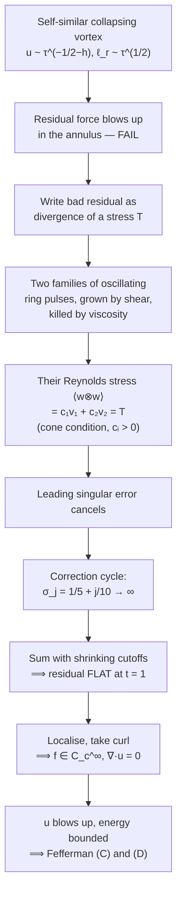

# Navier–Stokes From Scratch

> [!abstract] How to read this note
> Everything here is built from nothing. No equation appears before the idea it encodes. Every symbol is defined twice: once when it shows up, once in the glossary at the bottom.
>
> Work through it with a pencil. Reading physics is like reading a menu — it doesn't feed you.
>
> **Part I** builds the equation. **Part II** shows what it does. **Part III** is why it broke ninety years of mathematicians, and what happened in September 2026.

---

## 0. Before anything: what are we actually trying to do?

Here's the honest situation.

You have water in a pipe. Water is made of molecules — about $3 \times 10^{22}$ of them in a tablespoon. If you wanted to predict the flow by tracking molecules, you'd need $10^{22}$ positions and $10^{22}$ velocities, all colliding a few billion times a second. That's not physics, that's bookkeeping, and nobody can do it.

So we cheat. And here's the thing — it's a *magnificent* cheat, and I want you to feel exactly how outrageous it is before we do any mathematics.

**The cheat:** pretend the water is a smooth jelly. Pretend that at every single point $\mathbf{x}$ in space, at every time $t$, there is a well-defined velocity $\mathbf{u}(\mathbf{x},t)$, a density $\rho(\mathbf{x},t)$, a pressure $p(\mathbf{x},t)$. No molecules. No gaps. Just smooth fields, infinitely divisible.

That's a lie. There *are* gaps. But it's a lie that works, and we should understand why before we trust it.

### Why the lie works

Take a little cube of side $\ell$ inside the water and count the molecules $N$ inside it. The number fluctuates as molecules wander in and out. Statistical mechanics says the fluctuation is of order $\sqrt{N}$, so the *relative* wobble in density is

$$\frac{\delta \rho}{\rho} \sim \frac{1}{\sqrt{N}}.$$

Now: how big does $\ell$ have to be so that this wobble is, say, one part in a million? You need $N \sim 10^{12}$. For water, that's a cube about $0.3$ microns on a side. Tiny! Smaller than a bacterium.

So here's the picture you should hold in your head:

```
   molecular scale              "fluid parcel"            apparatus
        ~ 0.3 nm                  ~ 0.3 µm                ~ 1 cm
   |----------------|--------------------------|--------------------|
    chaos, discrete   BIG enough to average,     what you care about
                      SMALL enough to be a
                      "point" for your problem

                      <-- this gap is the
                          whole game -->
```

There's a window — three or four orders of magnitude wide — where a blob is simultaneously *huge* compared to a molecule and *microscopic* compared to your pipe. In that window you can define a smooth average velocity and it means something. That blob is called a **fluid parcel** (or fluid element). It's the atom of our theory, except it isn't an atom at all — it's a statistical fiction that behaves better than the real thing.

> [!important] The continuum hypothesis
> **Continuum hypothesis:** there exists a length scale $\ell$ with $\ell_{\text{molecular}} \ll \ell \ll \ell_{\text{apparatus}}$, and the fluid can be described by smooth fields defined by averaging over blobs of size $\ell$.
>
> The dimensionless number that measures this is the **Knudsen number**,
> $$\mathrm{Kn} = \frac{\lambda_{\text{mfp}}}{L},$$
> where $\lambda_{\text{mfp}}$ is the molecular mean free path and $L$ is your apparatus size. Continuum mechanics needs $\mathrm{Kn} \ll 1$. For water in a pipe, $\mathrm{Kn} \sim 10^{-8}$. Beautiful. For a satellite in the upper atmosphere, $\mathrm{Kn} \sim 10$, and Navier–Stokes is garbage there — you must go back to molecules.

Remember this. Hold onto it. Because in Part III, the entire Millennium Prize question turns out to be: **does this lie ever break itself?** Can the smooth fields, evolving by their own smooth rules, tear themselves into infinity in finite time — which would mean the continuum description has self-destructed and you'd have to go back to counting molecules?

That's not a technicality. That's the deepest question you can ask about a physical model: *does it know when it's wrong?*

---

# PART I — BUILDING THE EQUATION

## 1. The toolkit: vector calculus, defined properly

I refuse to write $\nabla$ at you without telling you what it is. Let's set up notation.

### 1.1 The fields

| Symbol | Name | Type | Units (SI) | Meaning |
|---|---|---|---|---|
| $\mathbf{x} = (x_1,x_2,x_3)$ | position | vector | m | a point in space, *fixed* in the lab |
| $t$ | time | scalar | s | |
| $\mathbf{u}(\mathbf{x},t) = (u_1,u_2,u_3)$ | velocity field | vector field | m/s | velocity of the parcel *currently at* $\mathbf{x}$ |
| $\rho(\mathbf{x},t)$ | density | scalar field | kg/m³ | mass per volume |
| $p(\mathbf{x},t)$ | pressure | scalar field | Pa = N/m² | isotropic squeeze |
| $\mathbf{f}(\mathbf{x},t)$ | body force density | vector field | N/kg (=m/s²) | gravity, magnetic forcing, etc., per unit mass |
| $\mu$ | dynamic viscosity | scalar constant | Pa·s | how much the fluid resists shearing |
| $\nu = \mu/\rho$ | kinematic viscosity | scalar constant | m²/s | viscosity per unit inertia |

The single most important thing to understand about $\mathbf{u}(\mathbf{x},t)$: **it is not the velocity of a particular blob of water.** It is the velocity of *whatever blob happens to be sitting at the point $\mathbf{x}$ at time $t$*. Different blob every instant. This is called the **Eulerian** description — you stand still and watch stuff fly past.

The alternative — following one blob around like a tagged fish — is the **Lagrangian** description. Both are correct. Eulerian is more convenient for writing PDEs; Lagrangian is more convenient for stating Newton's laws. Section 2 is entirely about the bridge between them, and that bridge is the single most important idea in this whole subject.

### 1.2 The operators

Let $\phi$ be a scalar field and $\mathbf{a} = (a_1, a_2, a_3)$ a vector field. Define the symbol

$$\nabla = \left( \frac{\partial}{\partial x_1}, \frac{\partial}{\partial x_2}, \frac{\partial}{\partial x_3} \right).$$

It isn't a vector. It's a *machine shaped like* a vector, and you can feed it things in the three ways a vector allows:

**Gradient** (feed it a scalar, get a vector):
$$\nabla \phi = \left( \frac{\partial \phi}{\partial x_1}, \frac{\partial \phi}{\partial x_2}, \frac{\partial \phi}{\partial x_3} \right)$$
*Meaning:* points in the direction $\phi$ increases fastest; its length is the rate of increase. On a hill, $\nabla(\text{height})$ points straight uphill.

**Divergence** (dot it into a vector, get a scalar):
$$\nabla \cdot \mathbf{a} = \frac{\partial a_1}{\partial x_1} + \frac{\partial a_2}{\partial x_2} + \frac{\partial a_3}{\partial x_3}$$
*Meaning:* net outflow per unit volume. Put a tiny imaginary balloon at a point. If stuff is flowing out of it faster than in, $\nabla \cdot \mathbf{a} > 0$: that point is a **source**. If $\nabla \cdot \mathbf{a} = 0$ everywhere, nothing is created or destroyed anywhere.

**Curl** (cross it into a vector, get a vector):
$$\nabla \times \mathbf{a} = \left( \frac{\partial a_3}{\partial x_2} - \frac{\partial a_2}{\partial x_3},\ \frac{\partial a_1}{\partial x_3} - \frac{\partial a_3}{\partial x_1},\ \frac{\partial a_2}{\partial x_1} - \frac{\partial a_1}{\partial x_2} \right)$$
*Meaning:* local spin. Drop a tiny paddlewheel into the flow. It spins with angular velocity $\tfrac{1}{2}\nabla \times \mathbf{u}$. Not the big circular motion of the whole fluid — the *local* twist right at that point.

**Laplacian** (divergence of a gradient):
$$\nabla^2 \phi = \nabla \cdot (\nabla \phi) = \frac{\partial^2 \phi}{\partial x_1^2}+\frac{\partial^2 \phi}{\partial x_2^2}+\frac{\partial^2 \phi}{\partial x_3^2}$$
*Meaning — and this is the one people never get told:* $\nabla^2 \phi$ at a point measures **how much $\phi$ at that point differs from the average of $\phi$ on a tiny sphere around it**. Precisely,

$$\overline{\phi}_{\text{sphere of radius } r} - \phi(\mathbf{x}) \approx \frac{r^2}{6}\nabla^2 \phi(\mathbf{x}).$$

So if $\nabla^2 \phi > 0$, you're in a dip — your neighbours are higher than you. The heat equation $\partial_t \phi = \kappa \nabla^2 \phi$ therefore says: *"if your neighbours are hotter than you, warm up."* That's it. That's diffusion. Every smoothing term in physics is a Laplacian and it always means the same thing: **be more like your neighbours**.

Hold onto that too. When we get to the viscous term $\nu \nabla^2 \mathbf{u}$ in Navier–Stokes, I want you to read it as *"match your neighbours' velocity"* — that's literally what friction between fluid layers does.

**Directional derivative** (the awkward one):
$$(\mathbf{a} \cdot \nabla) = a_1 \frac{\partial}{\partial x_1} + a_2 \frac{\partial}{\partial x_2} + a_3 \frac{\partial}{\partial x_3}$$
This is a scalar operator. Apply it to a vector field componentwise:
$$(\mathbf{a}\cdot\nabla)\mathbf{b} = \big( (\mathbf{a}\cdot\nabla)b_1,\ (\mathbf{a}\cdot\nabla)b_2,\ (\mathbf{a}\cdot\nabla)b_3 \big)$$
*Meaning:* rate of change of $\mathbf{b}$ as you walk in the direction $\mathbf{a}$, at speed $|\mathbf{a}|$.

### 1.3 Index notation (learn this, it will save your life)

Writing out three components is tedious. Use indices $i, j \in \{1,2,3\}$ and the **summation convention**: *any index repeated twice in a term is summed over*.

- $\nabla \cdot \mathbf{a} = \partial_i a_i$  (means $\partial_1 a_1 + \partial_2 a_2 + \partial_3 a_3$)
- $(\mathbf{a}\cdot\nabla)b_i = a_j \partial_j b_i$
- $\nabla^2 \phi = \partial_j \partial_j \phi$
- Kronecker delta $\delta_{ij} = 1$ if $i=j$, else $0$. Note $\delta_{ii}=3$.
- $\partial_i x_j = \delta_{ij}$

Also useful: the **divergence theorem** (Gauss). For any nice region $V$ with boundary surface $\partial V$ and outward unit normal $\mathbf{n}$:

$$\int_V \nabla \cdot \mathbf{a}\ dV = \oint_{\partial V} \mathbf{a}\cdot\mathbf{n}\ dS$$

In words: *"total production inside = total flux out through the skin."* Every conservation law in physics is this theorem wearing a costume.

---

## 2. The material derivative — the bridge between Newton and fields

This is the idea. If you only take one thing from Part I, take this.

Newton's second law is about *objects*. $F = ma$ applies to a thing you can point at, a thing with an identity, a thing you follow. But our fields $\mathbf{u}(\mathbf{x},t)$ are defined at *fixed points in space*, and the fluid rushes past those points. So how do we write $F = ma$?

### 2.1 The problem, made concrete

Picture a river that narrows into a rapid. It's been flowing steadily all day — nothing changes with time. At any fixed point on the bank, the water speed is the same at noon as at 3pm:

$$\frac{\partial \mathbf{u}}{\partial t} = 0.$$

But a leaf floating down that river *definitely accelerates* as it enters the narrow bit. It speeds up. Something is pushing it. There is a force.

So $\partial \mathbf{u}/\partial t$ is **not** the acceleration of the fluid. It's the rate of change *at a fixed point*, which is a different animal entirely. We need the acceleration *of the parcel*.

```
        wide                       narrow
  ~~~~~~~~~~~~~~~~~~~~~~\
      leaf →                \____→→→→ leaf →→→
       slow                        FAST
  ~~~~~~~~~~~~~~~~~~~~~~/

  At any FIXED point: nothing changes with time.   ∂u/∂t = 0
  For the LEAF: it speeds up.                      Du/Dt ≠ 0
```

### 2.2 Deriving it

Let $\mathbf{X}(t)$ be the position of one tagged parcel. By definition its velocity is the field evaluated wherever it currently is:

$$\frac{d\mathbf{X}}{dt} = \mathbf{u}(\mathbf{X}(t), t).$$

Now let $\phi(\mathbf{x},t)$ be any property (temperature, a velocity component, anything). What the parcel experiences is $\phi(\mathbf{X}(t), t)$. Differentiate with the chain rule:

$$\frac{d}{dt}\phi(\mathbf{X}(t),t) = \frac{\partial \phi}{\partial t} + \frac{\partial \phi}{\partial x_j}\frac{dX_j}{dt} = \frac{\partial \phi}{\partial t} + u_j \frac{\partial \phi}{\partial x_j}.$$

That's it. Give it a name and a symbol:

> [!important] The material derivative
> $$\boxed{\ \frac{D}{Dt} \;=\; \underbrace{\frac{\partial}{\partial t}}_{\text{local}} \;+\; \underbrace{(\mathbf{u}\cdot\nabla)}_{\text{convective}}\ }$$
>
> - **Local term** $\partial_t$: "the field itself is changing in time."
> - **Convective term** $(\mathbf{u}\cdot\nabla)$: "I'm being carried into a region where the field has a different value."
>
> $D/Dt$ is the derivative *a parcel feels*. It is the derivative Newton's law wants.

For the river: $\partial_t \mathbf{u} = 0$ (steady), but $(\mathbf{u}\cdot\nabla)\mathbf{u} \neq 0$ (you're swept into faster water). The leaf accelerates. Solved.

### 2.3 Why this one term is the villain of the entire subject

Look hard at $(\mathbf{u}\cdot\nabla)\mathbf{u}$. It has $\mathbf{u}$ in it **twice**. It is *quadratic* in the unknown.

That single fact is responsible for:

- turbulence,
- the impossibility of general closed-form solutions,
- the failure of superposition (you cannot add two solutions to get a third),
- chaos and sensitivity to initial conditions,
- and — I am not exaggerating — the entire Millennium Prize Problem.

Every linear PDE in physics is, in principle, solvable: Fourier transform, solve mode by mode, add up. Nonlinear terms couple the modes. Big eddies feed little eddies feed littler eddies. Energy cascades *downward in scale*, and the question of whether it can reach scale zero in finite time is exactly the open problem.

Mark that term. It's the one that bites.

---

## 3. Conservation of mass → the continuity equation

Now let's actually derive things. First law: **mass doesn't appear or disappear.**

### 3.1 The box argument

Fix an imaginary box $V$ in space. Don't let it move. Watch mass flow through it.

```
              ↑ flux out
         ┌─────────────┐
  flux → │             │ → flux out
   in    │      V      │
         │   mass M    │
         └─────────────┘
              ↑ flux in

   dM/dt  =  −(net flux out through the skin)
```

Mass inside: $M = \int_V \rho\, dV$.

Mass crossing a patch of the surface with area $dS$ and outward normal $\mathbf{n}$, per second: the fluid carries density $\rho$ at velocity $\mathbf{u}$, so the mass flux is the vector $\rho\mathbf{u}$ and the outflow through that patch is $\rho \mathbf{u}\cdot\mathbf{n}\, dS$.

Conservation says:

$$\frac{d}{dt}\int_V \rho\, dV = -\oint_{\partial V} \rho\,\mathbf{u}\cdot\mathbf{n}\, dS.$$

The box is fixed, so $d/dt$ passes inside as $\partial_t$. Apply the divergence theorem to the right side:

$$\int_V \frac{\partial \rho}{\partial t}\, dV = -\int_V \nabla\cdot(\rho \mathbf{u})\, dV
\quad\Longrightarrow\quad
\int_V \left[ \frac{\partial \rho}{\partial t} + \nabla\cdot(\rho\mathbf{u}) \right] dV = 0.$$

Now the key step, and it's a move we'll use again: **this holds for every box $V$ you can draw.** If the integral of a continuous function is zero over *every* region, the function is identically zero. (If it were positive somewhere, draw a tiny box there and get a positive integral. Contradiction.)

> [!important] Continuity equation
> $$\boxed{\ \frac{\partial \rho}{\partial t} + \nabla\cdot(\rho\mathbf{u}) = 0\ }$$

### 3.2 The incompressible form

Expand the divergence using the product rule, $\nabla\cdot(\rho\mathbf{u}) = \mathbf{u}\cdot\nabla\rho + \rho\,\nabla\cdot\mathbf{u}$:

$$\frac{\partial \rho}{\partial t} + \mathbf{u}\cdot\nabla \rho + \rho\,\nabla\cdot\mathbf{u} = 0
\quad\Longrightarrow\quad
\frac{D\rho}{Dt} = -\rho\,\nabla\cdot\mathbf{u}.$$

Read that out loud: *"the density of a parcel changes only if the parcel's volume changes."* And $\nabla\cdot\mathbf{u}$ is precisely the fractional rate of volume change of a parcel. (Check it yourself: a cube with sides $\delta x_i$ has $\frac{1}{V}\frac{DV}{Dt} = \partial_i u_i$.)

**Incompressible** means each parcel keeps its volume: $D\rho/Dt = 0$, hence

$$\boxed{\ \nabla\cdot\mathbf{u} = 0\ }$$

> [!warning] Incompressible ≠ constant density
> Ocean water is incompressible but stratified — salty water below, fresh above — so $\rho$ varies in space. Incompressibility says each parcel *preserves* its own density, not that all parcels share one.
>
> For the rest of this note I take $\rho = \text{const}$, which is the case of the Millennium Problem.

**When is a real fluid "incompressible"?** When flow speeds are much less than the speed of sound: $\mathrm{Ma} = U/c \ll 1$, where $\mathrm{Ma}$ is the **Mach number**. Density variations scale like $\mathrm{Ma}^2$. Walking speed in air is $\mathrm{Ma}\approx 0.004$, so $\delta\rho/\rho \sim 10^{-5}$. Air is "incompressible" when you walk through it. It is emphatically not when you fly a jet through it.

---

## 4. Conservation of momentum → the Cauchy equation

Second law: $\mathbf{F} = m\mathbf{a}$, applied to a parcel.

### 4.1 Setting it up

Take a parcel of volume $V$ (now we follow it, so use $D/Dt$). Its mass is $\int_V \rho\, dV$, constant by conservation of mass.

$$\underbrace{\int_V \rho \frac{D\mathbf{u}}{Dt}\, dV}_{m\mathbf{a}} = \underbrace{\int_V \rho \mathbf{f}\, dV}_{\text{body forces}} + \underbrace{\oint_{\partial V} \mathbf{t}\, dS}_{\text{surface forces}}$$

Two kinds of force, and the distinction matters:

- **Body forces** reach in and pull on every bit of the interior: gravity, electromagnetism, centrifugal force in a rotating frame. Proportional to volume. Written $\rho\mathbf{f}$ where $\mathbf{f}$ is force per unit *mass*.
- **Surface forces** act only on the skin: the neighbouring fluid pushing and dragging on the boundary. Proportional to area. The force per unit area is called the **traction** $\mathbf{t}$.

### 4.2 The stress tensor — why nine numbers

Here's the subtle bit that people rush past. The traction $\mathbf{t}$ depends on the *orientation* of the surface you're looking at.

Think about it physically. Put your hand in a flowing river. Hold it palm-down (flat to the flow): you feel drag along your palm. Hold it palm-forward (perpendicular to the flow): you feel a shove. Same fluid, same point in space — different force, because you changed the orientation of the surface.

So $\mathbf{t} = \mathbf{t}(\mathbf{n})$, where $\mathbf{n}$ is the surface normal. **Cauchy's theorem** says this dependence is linear:

$$t_i = \sigma_{ij} n_j$$

The object $\sigma_{ij}$ is the **stress tensor**. Nine numbers at every point.

*Why linear?* Shrink a tiny tetrahedron with three faces on the coordinate planes and one slanted face with normal $\mathbf{n}$. Surface forces scale like $\ell^2$; inertia and body forces scale like $\ell^3$. As $\ell\to0$ the volume terms die faster, so the surface forces must balance among themselves. Doing the bookkeeping on the four faces gives exactly $t_i = \sigma_{ij}n_j$. That's Cauchy's tetrahedron argument, and it's one of the prettiest arguments in continuum mechanics.

**Reading the indices:**

$$\sigma_{ij} = \begin{pmatrix} \sigma_{11} & \sigma_{12} & \sigma_{13} \\ \sigma_{21} & \sigma_{22} & \sigma_{23} \\ \sigma_{31} & \sigma_{32} & \sigma_{33} \end{pmatrix}$$

$\sigma_{ij}$ = the $i$-th component of force, per unit area, on a surface whose normal points in the $j$ direction.

- **Diagonal** ($i = j$): force perpendicular to the face. Push or pull. **Normal stress.**
- **Off-diagonal** ($i \neq j$): force parallel to the face. Dragging sideways. **Shear stress.**

```
         σ22
          ↑
      ┌───│───┐
  σ12 ←   │   → σ12          the little square feels:
      │   │   │               - pushes on its faces (diagonal)
 σ11 ←│   ●   │→ σ11          - drags along its faces (off-diagonal)
      │       │
      └───────┘
          ↓
         σ22
```

**Symmetry:** $\sigma_{ij} = \sigma_{ji}$. Why? Conservation of *angular* momentum. Compute the torque on a small cube of side $\ell$: the shear stresses give a net torque $\propto (\sigma_{12}-\sigma_{21})\ell^3$, while the moment of inertia is $\propto \ell^5$. Angular acceleration would go like $\ell^{-2} \to \infty$ as $\ell\to0$ unless $\sigma_{12} = \sigma_{21}$. Tiny cubes would spin infinitely fast. So the tensor is symmetric: six independent numbers, not nine.

### 4.3 Cauchy's momentum equation

Convert the surface integral with the divergence theorem ($\oint \sigma_{ij}n_j dS = \int \partial_j \sigma_{ij} dV$), and again use "true for every parcel":

> [!important] Cauchy momentum equation
> $$\boxed{\ \rho \frac{Du_i}{Dt} = \partial_j \sigma_{ij} + \rho f_i\ }$$
> or in vector form $\ \rho \dfrac{D\mathbf{u}}{Dt} = \nabla\cdot\boldsymbol{\sigma} + \rho\mathbf{f}.$

This is exact. It's true for water, honey, steel, toothpaste, blood, the Earth's mantle, and custard. It contains no physics about *what kind of stuff* you have — it's just $F=ma$ plus the fact that surface forces are a tensor.

Which means it's also useless on its own. Count unknowns: $\mathbf{u}$ (3) $+\ \rho$ (1) $+\ \sigma_{ij}$ (6) $=$ 10. Count equations: continuity (1) + momentum (3) $=$ 4.

Six short. We need to say what the material *is*.

---

## 5. The constitutive relation: what makes a fluid a fluid

This is where the physics of the *substance* enters. And notice — this is a modelling choice, not a theorem. We're going to make assumptions, and the assumptions are where the theory can be wrong.

### 5.1 Split off the pressure

Even a fluid sitting perfectly still has stress: hydrostatic pressure. It squeezes equally in all directions, which means it's proportional to the identity:

$$\sigma_{ij} = -p\,\delta_{ij} + \tau_{ij}$$

- $-p\,\delta_{ij}$: the **isotropic part**. Minus sign because positive $p$ means *compression* (pushing inward), while positive $\sigma$ conventionally means tension.
- $\tau_{ij}$: the **deviatoric** or **viscous stress**. Everything left over. By construction it's what appears *only when the fluid deforms*.

> [!important] The definition of a fluid
> A **fluid** is a material that cannot sustain shear stress at rest. Push a solid sideways, it deforms a bit and stops, pushing back. Push a fluid sideways, it keeps flowing forever.
>
> So for a fluid, $\tau_{ij}$ depends on the **rate** of deformation, not the amount. Solids: stress $\propto$ strain. Fluids: stress $\propto$ strain *rate*. That one word — "rate" — is the entire difference.

### 5.2 What does "rate of deformation" mean?

The full local velocity variation is $\partial_j u_i$, nine numbers. Split it into symmetric and antisymmetric parts (you can always do this to any matrix):

$$\partial_j u_i = \underbrace{\tfrac{1}{2}\left(\partial_j u_i + \partial_i u_j\right)}_{S_{ij}\ \text{strain-rate}} + \underbrace{\tfrac{1}{2}\left(\partial_j u_i - \partial_i u_j\right)}_{\Omega_{ij}\ \text{rotation-rate}}$$

Why split? Because **rigid rotation isn't deformation**. If you put a glass of water on a turntable and spin it up until the whole thing rotates as a solid block, there's no internal friction, no shearing, nothing rubbing. A viscous stress law that produced friction from pure rotation would be physically absurd — it would mean a rotating bucket of water heats up forever.

$\Omega_{ij}$ encodes exactly that rigid rotation (it's the vorticity in disguise: $\Omega_{ij} = -\tfrac{1}{2}\epsilon_{ijk}\omega_k$). So viscous stress must depend on $S_{ij}$ **only**.

Geometric meaning of $S_{ij}$: draw a tiny sphere of fluid. After a short time it becomes an ellipsoid. $S_{ij}$ tells you the stretching rates along the principal axes. Diagonal entries: stretching/squashing. Off-diagonal: shearing (a square becoming a rhombus).

### 5.3 The Newtonian assumption

Now we assume — *assume*, this is the modelling step — that:

1. $\tau_{ij}$ is a **linear** function of $S_{ij}$.
2. The fluid is **isotropic**: no built-in preferred directions.
3. $\tau_{ij}=0$ when $S_{ij}=0$ (no stress at rest).

Assumption 1 is the "Newtonian" bit, and it's a first-order Taylor expansion in disguise: if deformation rates are small compared to molecular relaxation rates, keep only the linear term. It works astonishingly well for water, air, most oils, and glycerine. It fails for blood, ketchup, cornstarch-in-water, polymer melts, toothpaste, and lava — the **non-Newtonian** fluids, which are a whole separate (and delightful) subject.

Assumption 2 does enormous work. The most general isotropic linear map from a symmetric tensor to a symmetric tensor has only **two** free constants:

$$\tau_{ij} = 2\mu\, S_{ij} + \lambda\, S_{kk}\,\delta_{ij}$$

where $S_{kk} = \partial_k u_k = \nabla\cdot\mathbf{u}$ is the trace (the expansion rate).

Why only two? Because from $S_{ij}$ and $\delta_{ij}$, isotropy lets you build exactly two linear invariant combinations: $S_{ij}$ itself, and $\delta_{ij}$ times the trace. Anything else would require a preferred direction, and by assumption there isn't one. Isotropy is a fantastically powerful constraint — it collapses 81 possible coefficients down to 2.

- $\mu$ = **dynamic (shear) viscosity**. Resistance to shearing.
- $\lambda$ = **second viscosity**. Resistance to pure expansion. Stokes proposed $\lambda = -\tfrac{2}{3}\mu$ so that the mechanical pressure equals the thermodynamic pressure. For incompressible flow, $\nabla\cdot\mathbf{u}=0$ kills this term entirely, so who cares.

### 5.4 Sanity check: does $\mu$ mean what you think?

Simple shear between two plates, gap $h$, top plate moving at $U$:

```
   ═══════════════════════ →  U     (moving plate)
        →→→→→→→→
          →→→→→
            →→                       u_1 = U·y/h
              →
   ═══════════════════════           (fixed plate)
```

Here $u_1 = Uy/h$, all else zero. Then $S_{12} = \tfrac12 \partial_2 u_1 = U/(2h)$, so

$$\tau_{12} = 2\mu S_{12} = \mu \frac{U}{h} = \mu \frac{du_1}{dy}.$$

Which is exactly Newton's law of viscosity from 1687: **shear stress is proportional to velocity gradient.** Good. Our machinery reproduces the thing it was supposed to. Water: $\mu \approx 10^{-3}$ Pa·s. Honey: $\approx 10$. Glass at room temperature: $\approx 10^{20}$ (which is why cathedral windows are *not*, contrary to the myth, measurably thicker at the bottom — do the arithmetic).

---

## 6. Assembling the Navier–Stokes equations

Put the constitutive law into Cauchy:

$$\rho\frac{Du_i}{Dt} = \partial_j\left[ -p\delta_{ij} + 2\mu S_{ij} + \lambda (\nabla\cdot\mathbf{u})\delta_{ij} \right] + \rho f_i$$

Take $\mu, \lambda$ constant (true if temperature is roughly uniform). Work out the middle term:

$$\partial_j (2\mu S_{ij}) = \mu\,\partial_j\left(\partial_j u_i + \partial_i u_j\right) = \mu\left[\nabla^2 u_i + \partial_i(\nabla\cdot\mathbf{u})\right]$$

So the **compressible Navier–Stokes momentum equation** is

$$\rho\frac{D\mathbf{u}}{Dt} = -\nabla p + \mu\nabla^2\mathbf{u} + (\mu+\lambda)\nabla(\nabla\cdot\mathbf{u}) + \rho\mathbf{f}$$

### 6.1 The incompressible equations — the main event

Set $\nabla\cdot\mathbf{u}=0$, $\rho=$ const. The $(\mu+\lambda)$ term vanishes. Divide through by $\rho$ and define $\nu = \mu/\rho$ and $P = p/\rho$:

> [!important] The incompressible Navier–Stokes equations
> $$\boxed{\ \frac{\partial \mathbf{u}}{\partial t} + (\mathbf{u}\cdot\nabla)\mathbf{u} = -\nabla P + \nu\nabla^2\mathbf{u} + \mathbf{f}\ }$$
> $$\boxed{\ \nabla\cdot\mathbf{u} = 0\ }$$
> with initial condition $\mathbf{u}(\mathbf{x},0)=\mathbf{u}_0(\mathbf{x})$ (divergence-free), plus boundary conditions.
>
> Unknowns: $\mathbf{u}$ (3 components) and $P$ (1). Equations: 3 + 1. Closed at last.

### 6.2 Reading the equation like a sentence

Do not memorise this. *Read* it. Each term is a physical statement:

| Term | Name | What it says | Linear? |
|---|---|---|---|
| $\partial_t \mathbf{u}$ | unsteady / local acceleration | the velocity at this point is changing | linear |
| $(\mathbf{u}\cdot\nabla)\mathbf{u}$ | **convective acceleration** | I'm being swept into a region of different velocity | **nonlinear** ← the troublemaker |
| $-\nabla P$ | pressure gradient | fluid gets pushed from high pressure to low | linear |
| $\nu\nabla^2\mathbf{u}$ | viscous diffusion | match your neighbours' velocity (friction) | linear |
| $\mathbf{f}$ | body force | gravity, stirring, external forcing | given |

The whole equation is: **acceleration = pressure push + friction + external force.** That's all. It's $F = ma$ for jelly.

### 6.3 Boundary conditions — the physics you can't skip

A PDE without boundary conditions is a question without a subject.

- **No-slip at a solid wall:** $\mathbf{u} = \mathbf{u}_{\text{wall}}$. The fluid *sticks*. Not just "doesn't go through" — it doesn't *slide* either. This surprises people, and it surprised the nineteenth century so badly that it was argued about for decades. It's an empirical fact, justified microscopically: molecules hitting a rough wall get momentum-randomised and re-emitted with zero mean tangential velocity. It's why you can't blow all the dust off a table, and why the air right against an aeroplane wing is moving with the wing.
- **At infinity:** $\mathbf{u}\to 0$ (or some prescribed uniform flow), with decay fast enough that the total energy is finite.
- **Periodic:** put the fluid on a torus $\mathbb{T}^3$. Artificial but mathematically clean — no walls to worry about. This is variant (B)/(D) of the Millennium Problem.

### 6.4 Where did the pressure equation go?

Here is a genuinely strange feature of the incompressible equations, and it trips up everyone the first time.

There is **no evolution equation for $p$.** No $\partial_t p$ anywhere. So what determines it?

Take the divergence of the momentum equation and use $\nabla\cdot\mathbf{u}=0$ (so $\nabla\cdot\partial_t\mathbf{u} = 0$ and $\nabla\cdot\nabla^2\mathbf{u}=0$):

$$\nabla^2 P = -\nabla\cdot\left[(\mathbf{u}\cdot\nabla)\mathbf{u}\right] + \nabla\cdot\mathbf{f} = -\,\partial_i u_j\,\partial_j u_i + \nabla\cdot\mathbf{f}$$

That's a **Poisson equation**: elliptic, not evolutionary. It has no time derivative. Which means:

> [!warning] Pressure is instantaneous and nonlocal
> To find $P$ at one point, you must solve an elliptic equation over the *whole domain*. The pressure at your nose depends, instantaneously, on the velocity field everywhere in the room.
>
> This is not a violation of relativity — it's the artefact of taking the sound speed to infinity, which is exactly what "incompressible" means. Sound waves normally carry pressure information at speed $c$; we set $c = \infty$.
>
> Mathematically: **pressure is a Lagrange multiplier** enforcing the constraint $\nabla\cdot\mathbf{u}=0$. It's whatever pressure field is required, at each instant, to keep the flow divergence-free. It does no work and stores no energy. It's a bookkeeper.
>
> And it is a large part of why the mathematics is hard: that nonlocality means you cannot use a **maximum principle**. For the heat equation, or even viscous Burgers, you can prove the maximum of the solution never increases, which instantly rules out blowup. Navier–Stokes has no such principle, because the pressure can reach in from far away and push. Kill that hope early.

---

# PART II — WHAT THE EQUATION DOES

## 7. Nondimensionalisation and the Reynolds number

Physics doesn't care about your units. Let's get rid of them and see what's actually left.

Pick a characteristic speed $U$ and length $L$ for your problem (pipe: mean flow speed and diameter). Define dimensionless variables with stars:

$$\mathbf{x} = L\mathbf{x}^*,\qquad \mathbf{u}=U\mathbf{u}^*,\qquad t = \frac{L}{U}t^*,\qquad P = U^2 P^*.$$

Substitute into the momentum equation, take $\mathbf{f}=0$, and grind:

$$\frac{U^2}{L}\left[\frac{\partial\mathbf{u}^*}{\partial t^*} + (\mathbf{u}^*\cdot\nabla^*)\mathbf{u}^*\right] = -\frac{U^2}{L}\nabla^* P^* + \frac{\nu U}{L^2}\nabla^{*2}\mathbf{u}^*$$

Divide by $U^2/L$:

$$\frac{\partial\mathbf{u}^*}{\partial t^*} + (\mathbf{u}^*\cdot\nabla^*)\mathbf{u}^* = -\nabla^* P^* + \frac{1}{\mathrm{Re}}\nabla^{*2}\mathbf{u}^*$$

Every unit is gone. **One number is left.**

> [!important] Reynolds number
> $$\boxed{\ \mathrm{Re} = \frac{UL}{\nu} = \frac{\rho U L}{\mu} \ }$$
> $$\mathrm{Re} \sim \frac{|(\mathbf{u}\cdot\nabla)\mathbf{u}|}{|\nu\nabla^2\mathbf{u}|} \sim \frac{U^2/L}{\nu U/L^2} = \frac{\text{inertia}}{\text{viscosity}}$$

This is one of the great results in physics. Two flows with completely different fluids, speeds, and sizes behave **identically** if they share the same $\mathrm{Re}$. It's why you can test a ship hull or an aircraft in a scale-model tank or tunnel. Dynamic similarity.

Feel the numbers:

| Situation | $\mathrm{Re}$ | Character |
|---|---|---|
| Bacterium swimming | $10^{-5}$ | Viscosity totally dominates. Stop pushing and you stop in $0.1$ µm. Momentum is meaningless. |
| Sperm cell | $10^{-2}$ | Same world. Swimming requires non-reciprocal strokes (the "scallop theorem"). |
| Blood in a capillary | $10^{-3}$ | Smooth, viscous, orderly. |
| Blood in the aorta | $\sim 4000$ | Transitional, partly turbulent. |
| Swimming human | $10^{6}$ | Inertia dominates; you glide. |
| Aircraft wing | $10^{7}$ | Turbulent boundary layer. |
| Weather system | $10^{12}$ | Viscosity is irrelevant except at millimetre scales. |

At low $\mathrm{Re}$, drop the nonlinear term entirely: you get the **Stokes equations**, which are linear, time-reversible, and completely solvable. Life for a bacterium is like swimming in tar — if it runs its flagellum backwards it retraces its path exactly and gets nowhere.

At high $\mathrm{Re}$, you'd think you could drop the viscous term (giving the **Euler equations**). **You cannot.** The viscous term has the highest derivative. Dropping it changes the *order* of the PDE, so you lose a boundary condition, and you can no longer impose no-slip. What actually happens is that viscosity survives in a thin **boundary layer** near walls, of thickness $\delta/L \sim \mathrm{Re}^{-1/2}$, where the velocity goes from wall-value to free-stream. Prandtl's 1904 insight, and it's the foundation of all aerodynamics. This is a **singular perturbation** — the limit $\nu\to0$ is not the same as $\nu=0$.

---

## 8. Vorticity — where the real action is

Pressure is a nuisance. Let's get rid of it.

Define the **vorticity**:

$$\boldsymbol{\omega} = \nabla\times\mathbf{u}$$

This is twice the local angular velocity of a fluid parcel. Take the curl of the momentum equation, use the identity

$$(\mathbf{u}\cdot\nabla)\mathbf{u} = \nabla\left(\tfrac12|\mathbf{u}|^2\right) - \mathbf{u}\times\boldsymbol{\omega}$$

and note that $\nabla\times\nabla(\text{anything}) = 0$ — so both the pressure gradient *and* the kinetic-energy gradient vanish. Gone. After some algebra using $\nabla\cdot\mathbf{u}=0$ and $\nabla\cdot\boldsymbol{\omega}=0$:

> [!important] Vorticity equation
> $$\boxed{\ \frac{D\boldsymbol{\omega}}{Dt} = \underbrace{(\boldsymbol{\omega}\cdot\nabla)\mathbf{u}}_{\text{vortex stretching}} + \underbrace{\nu\nabla^2\boldsymbol{\omega}}_{\text{diffusion}}\ }$$

No pressure. Beautiful.

### 8.1 Vortex stretching — the engine of turbulence and (probably) of blowup

That first term on the right is everything.

Think of a vortex tube — a bundle of spinning fluid, like a tornado. If the flow stretches the tube along its own axis, then by conservation of angular momentum it must **spin faster**, exactly like a figure skater pulling her arms in. Stretch it to half the radius and the spin rate goes up by four.

```
    BEFORE                    AFTER stretching
      ___                          _
     /   \                        | |
    |  ω  |   fat, slow           | |     thin, FAST
    |     |                       |ω|
     \___/                        | |     ω has grown
                                  |_|
    volume conserved (incompressible), so thinner ⇒ longer ⇒ faster spin
```

Mathematically: $(\boldsymbol{\omega}\cdot\nabla)\mathbf{u} = \boldsymbol{\omega}\cdot\mathbf{S}$ picks out the stretching rate along the vorticity direction. If $\boldsymbol{\omega}$ aligns with a stretching eigenvector of $\mathbf{S}$, then roughly

$$\frac{D|\boldsymbol{\omega}|}{Dt} \sim \alpha |\boldsymbol{\omega}|, \qquad \alpha = \text{stretching rate}.$$

And here's the dangerous part: $\alpha$ is itself built from $\boldsymbol{\omega}$ (via a nonlocal Biot–Savart-type relation $\mathbf{u} = \text{curl}^{-1}\boldsymbol{\omega}$, so $|\mathbf{S}| \sim |\boldsymbol{\omega}|$). Schematically:

$$\frac{d\omega}{dt} \sim \omega^2 \quad\Longrightarrow\quad \omega(t) \sim \frac{\omega_0}{1-\omega_0 t} \longrightarrow \infty \ \text{ at } t = 1/\omega_0.$$

**A finite-time blowup, in finite time, from a simple ODE.** That's the threat. The whole question is whether viscosity ($\nu\nabla^2\boldsymbol{\omega}$) and the nonlocality of $\mathbf{S}$ (the real $\alpha$ isn't simply $\omega$) conspire to save you.

### 8.2 Why 2D is safe and 3D is not

In two dimensions, $\mathbf{u}=(u_1,u_2,0)$ with no $z$-dependence, so $\boldsymbol{\omega} = (0,0,\omega)$ points straight out of the plane. Then

$$(\boldsymbol{\omega}\cdot\nabla)\mathbf{u} = \omega\,\partial_z \mathbf{u} = 0.$$

**The stretching term vanishes identically.** The vorticity equation becomes

$$\frac{D\omega}{Dt} = \nu\nabla^2\omega$$

— a pure advection-diffusion equation. And *that* has a maximum principle: $\max|\omega|$ can never increase. Vorticity is bounded for all time. Smoothness follows.

> [!important] The single sentence that explains the whole problem
> **2D Navier–Stokes is solved (Ladyzhenskaya, 1959: global smooth solutions exist and are unique). 3D is open. The entire difference is the vortex-stretching term $(\boldsymbol{\omega}\cdot\nabla)\mathbf{u}$, which exists only when vorticity can tilt out of a plane.**

Three dimensions gives the vorticity somewhere to point, and that freedom is what might destroy you.

There's a matching theorem that makes this precise:

**Beale–Kato–Majda (1984):** a solution stays smooth up to time $T$ **if and only if**
$$\int_0^T \|\boldsymbol{\omega}(t)\|_{L^\infty}\,dt < \infty.$$

So blowup *is* vorticity blowup, and not just any blowup — the integral has to diverge. This is a very sharp criterion, and every serious attempt at the problem passes through it.

---

## 9. Energy — the one thing we can actually control

Multiply the momentum equation by $\mathbf{u}$ and integrate over space (take $\mathbf{f}=0$, decay at infinity). Every term does something nice:

- $\int \mathbf{u}\cdot\partial_t\mathbf{u} = \frac{d}{dt}\int \tfrac12|\mathbf{u}|^2$
- $\int \mathbf{u}\cdot(\mathbf{u}\cdot\nabla)\mathbf{u} = \int (\mathbf{u}\cdot\nabla)\tfrac12|\mathbf{u}|^2 = -\int \tfrac12 |\mathbf{u}|^2 (\nabla\cdot\mathbf{u}) = \mathbf{0}$ — **the nonlinear term does no net work**; it only shuffles energy between places and scales.
- $-\int\mathbf{u}\cdot\nabla P = \int P(\nabla\cdot\mathbf{u}) = 0$ — pressure does no work either.
- $\nu\int \mathbf{u}\cdot\nabla^2\mathbf{u} = -\nu\int|\nabla\mathbf{u}|^2$ — integration by parts.

> [!important] Energy identity
> $$\boxed{\ \frac{d}{dt}\underbrace{\int \tfrac12 |\mathbf{u}|^2 dV}_{E(t)} = -\nu \underbrace{\int |\nabla\mathbf{u}|^2 dV}_{\text{enstrophy-ish}} \;\le\; 0\ }$$
> $$\Longrightarrow\qquad E(t) + \nu\int_0^t \int|\nabla\mathbf{u}|^2\,dV\,ds \;=\; E(0)$$

Energy only decreases. Always. Viscosity converts kinetic energy into heat and never the other way.

This is our **one free lunch** — the only quantity we can bound for all time without doing any work. Everything in the rigorous theory is built on it.

And in Part III you'll see the punchline: **it isn't enough.** In 3D, this bound controls the wrong things at small scales. The cruelty of the problem is right there.

---

## 10. Exact solutions — the few places the beast lies down

Almost nothing about Navier–Stokes is solvable in closed form. Here are the exceptions. In every one, the killer term $(\mathbf{u}\cdot\nabla)\mathbf{u}$ vanishes identically by symmetry. That's the trick every time. Look for it.

### 10.1 Couette flow (drag between plates)

Steady flow between a fixed plate at $y=0$ and one at $y=h$ moving at speed $U$, no pressure gradient.

Guess $\mathbf{u} = (u(y),0,0)$. Then $(\mathbf{u}\cdot\nabla)\mathbf{u} = u\,\partial_x (u,0,0) = 0$ — the flow is uniform in the direction it moves. Nonlinearity dead. The equation collapses to $\mu\,u'' = 0$, so $u$ is linear:

$$u(y) = U\frac{y}{h},\qquad \tau = \mu\frac{U}{h}.$$

A straight line. This is how a viscometer works.

### 10.2 Hagen–Poiseuille flow (pipe)

Steady flow in a circular pipe of radius $R$, driven by a pressure drop $\Delta p$ over length $L$. Guess $\mathbf{u}=(0,0,u_z(r))$ in cylindrical coordinates. Again the nonlinear term dies. What survives:

$$\frac{\mu}{r}\frac{d}{dr}\left(r\frac{du_z}{dr}\right) = \frac{dp}{dz} = -\frac{\Delta p}{L}$$

Integrate twice, impose $u_z(R)=0$ (no-slip) and regularity at $r=0$:

$$\boxed{\ u_z(r) = \frac{\Delta p}{4\mu L}\left(R^2 - r^2\right)\ }$$

A **parabola**. Integrate for the volume flow rate:

$$Q = \int_0^R u_z\,2\pi r\,dr = \frac{\pi R^4 \Delta p}{8\mu L}$$

> [!tip] The $R^4$ law is worth pausing on
> Flow rate goes like **radius to the fourth power**. Halve the pipe radius, the flow drops by a factor of 16.
>
> This is why a small arterial narrowing is a big medical problem: a 20% reduction in radius cuts flow by ~60%. It's why your shower dies when someone flushes. And it's why the whole of plumbing, and much of cardiology, is downstream of one integral.

### 10.3 Stokes' first problem (the flat plate jerked into motion)

Infinite plate at $y=0$, fluid at rest, at $t=0$ the plate suddenly moves at $U$. No pressure gradient, no $x$-dependence. Nonlinear term: gone. The equation becomes the **heat equation**:

$$\frac{\partial u}{\partial t} = \nu\frac{\partial^2 u}{\partial y^2},\qquad u(0,t)=U,\ u(\infty,t)=0$$

Solution via the similarity variable $\eta = y/(2\sqrt{\nu t})$:

$$u(y,t) = U\,\mathrm{erfc}\!\left(\frac{y}{2\sqrt{\nu t}}\right)$$

The moving-fluid layer grows as $\delta \sim \sqrt{\nu t}$. **This is the fundamental diffusive scaling of the whole subject.** Momentum diffuses like heat: distance $\propto \sqrt{\text{time}}$. It's why viscous length scales always come with square roots, and why in Part III you'll see the core radius shrinking like $\tau^{1/2}$ — that's not a coincidence, it's this.

### 10.4 Burgers' equation — the toy model that teaches the lesson

Strip Navier–Stokes to one dimension, throw away pressure and incompressibility:

$$\partial_t u + u\,\partial_x u = \nu\,\partial_x^2 u$$

Same structure: time derivative, quadratic nonlinearity, viscous diffusion.

**Inviscid case ($\nu=0$):** characteristics carry $u$ at speed $u$. Fast bits catch slow bits, the profile steepens, and $\partial_x u \to -\infty$ in finite time. **A shock.** Blowup of the derivative. Easy.

**Viscous case ($\nu>0$):** no blowup, ever. Because Burgers has a **maximum principle** — $\max u$ can't grow — and that plus diffusion is enough to keep it smooth forever.

> [!warning] And here's why that lesson doesn't transfer
> Navier–Stokes has no maximum principle, because of (a) the pressure's nonlocality and (b) vortex stretching. The comforting Burgers intuition — "viscosity always wins" — has **no proof** in 3D. Tao made this concrete in 2016 by constructing an *averaged* Navier–Stokes equation, which keeps the exact energy identity of the real one but blows up in finite time. That result says: **you cannot prove regularity by energy methods alone.** Any successful proof must use something specific about the real nonlinearity that the averaged version lacks.

---

# PART III — THE MILLENNIUM PROBLEM AND THE 2026 RESULT

## 11. Stating the problem precisely

In 2000 the Clay Mathematics Institute named seven Millennium Prize Problems at \$1M each. One of them is Navier–Stokes, and the official statement was written by **Charles Fefferman**. It is worth reading carefully, because the *exact wording* turns out to matter enormously for what happened in 2026.

The setting: incompressible Navier–Stokes on $\mathbb{R}^3$ (or the torus $\mathbb{T}^3$), with $\nu>0$, smooth initial data $\mathbf{u}_0$ that is divergence-free and decays rapidly at infinity.

Fefferman offers **four** statements, any one of which wins the prize:

| | Domain | Force | Claim |
|---|---|---|---|
| **(A)** | $\mathbb{R}^3$ | $\mathbf{f}\equiv 0$ | Smooth solutions exist for all time. *(Prove regularity.)* |
| **(B)** | $\mathbb{T}^3$ | $\mathbf{f}\equiv 0$ | Same, periodic. *(Prove regularity.)* |
| **(C)** | $\mathbb{R}^3$ | $\mathbf{f}$ allowed (smooth, rapidly decaying) | Smoothness **fails**: exhibit a breakdown. *(Disprove regularity.)* |
| **(D)** | $\mathbb{T}^3$ | $\mathbf{f}$ allowed | Same, periodic. *(Disprove.)* |

> [!important] Read that table again
> In (C) and (D), the official statement **permits an external force** $\mathbf{f}$, provided $\mathbf{f}$ is smooth and decays fast in space and time. So a counterexample is allowed to stir the fluid — as long as the stirring itself is perfectly smooth and well behaved.
>
> That permission is exactly the door the 2026 result walked through. Keep it in mind.

The demand is a **finite-energy** solution: $\sup_t \int |\mathbf{u}|^2 dV < \infty$. You aren't allowed to cheat by pumping in infinite energy.

### 11.1 What was already known before 2026

| Year | Who | Result |
|---|---|---|
| 1934 | **Leray** | Global **weak** solutions exist on $\mathbb{R}^3$, for all time, satisfying an energy inequality. But they might not be smooth, and might not be unique. This is the foundation stone. |
| 1951 | Hopf | Same on bounded domains. |
| 1959 | Ladyzhenskaya | **2D is completely solved:** global, smooth, unique. |
| 1962 | Prodi, Serrin, Ladyzhenskaya | Conditional regularity: if $\mathbf{u}\in L^p_t L^q_x$ with $\frac{2}{p}+\frac{3}{q}\le 1$, it's smooth. |
| 1982 | **Caffarelli–Kohn–Nirenberg** | The singular set of a suitable weak solution has zero one-dimensional parabolic Hausdorff measure. Translation: singularities, if any, are extremely small — no curves or sheets of them. But **isolated points are not excluded.** |
| 1984 | Beale–Kato–Majda | Blowup $\iff \int_0^T\|\boldsymbol{\omega}\|_\infty dt = \infty$. |
| 2003 | Escauriaza–Seregin–Šverák | The borderline case: bounded $L^\infty_t L^3_x$ norm $\Rightarrow$ regularity. |
| 2016 | **Tao** | Finite-time blowup for an *averaged* Navier–Stokes that preserves the energy structure. "Energy methods alone cannot work." |
| 2019 | **Buckmaster–Vicol** | **Non-uniqueness** of finite-energy weak solutions, via *convex integration*. A new toolkit arrives. |
| 2022 | Albritton–Brué–Colombo | Non-uniqueness of *Leray–Hopf* solutions with a force, using an unstable vortex in similarity variables. |
| 2023–25 | Córdoba, Martínez-Zoroa, Zheng | Finite-time singularities for **forced 3D Euler**, and for hypodissipative Navier–Stokes, via amplification across scales. |

Read that list as a story: by 2020 the field had a new weapon (convex integration), a proof that the old weapons *couldn't* work (Tao), and a working template for building singularities out of many scales (Córdoba et al.). The 2026 result is the next link in that chain, not a bolt from the blue.

---

## 12. Why it's so hard: supercriticality

Here is the deep structural reason, and once you see it you'll never un-see it.

### 12.1 The scaling symmetry

Navier–Stokes has a built-in symmetry. If $(\mathbf{u},p)$ solves the equations, then so does

$$\mathbf{u}_\lambda(\mathbf{x},t) = \lambda\,\mathbf{u}(\lambda\mathbf{x},\lambda^2 t),\qquad p_\lambda(\mathbf{x},t)=\lambda^2 p(\lambda\mathbf{x},\lambda^2 t)$$

for any $\lambda>0$. Check it — every term picks up exactly $\lambda^3$. (Note the $\lambda^2$ in time: that's the diffusive $\sqrt{t}$ scaling from §10.3 again, showing up as a symmetry.)

Large $\lambda$ means **zooming in** on small scales and fast times.

### 12.2 Now watch what happens to the energy

$$\|\mathbf{u}_\lambda(0)\|_{L^2(\mathbb{R}^3)}^2 = \int \lambda^2 |\mathbf{u}(\lambda \mathbf{x})|^2 d^3x = \lambda^2 \cdot \lambda^{-3}\int|\mathbf{u}(\mathbf{y})|^2 d^3y = \lambda^{-1}\|\mathbf{u}(0)\|^2_{L^2}$$

So

$$\|\mathbf{u}_\lambda\|_{L^2} = \lambda^{-1/2}\|\mathbf{u}\|_{L^2} \xrightarrow[\lambda\to\infty]{} 0.$$

> [!danger] This is the entire difficulty, in one line
> **Zoom in, and the energy of what you're looking at goes to zero.**
>
> The energy bound — our only free lunch, the only thing conserved-ish for all time — becomes *weaker and weaker* at small scales. It gives you no control at all where the trouble is. The problem is **supercritical**.
>
> A singularity is a small-scale event. Our only global bound sees small scales as negligible. That's the trap.

Compare dimensions:
- The **critical** norms — the ones invariant under this scaling in 3D — are $\dot H^{1/2}$, $L^3$, $BMO^{-1}$. If you could bound *any* of those globally, you'd be done. (That's why Escauriaza–Seregin–Šverák, which handles $L^\infty_t L^3_x$, is celebrated: it's exactly critical.)
- The energy lives in $L^2$, which is **half a derivative too weak**.
- In **2D**, the same calculation gives $\|\mathbf{u}_\lambda\|_{L^2} = \lambda^0\|\mathbf{u}\|_{L^2}$ — energy is *exactly critical*. That's the real reason 2D works.

The gap between "$L^2$" and "$\dot H^{1/2}$" is half a derivative. Ninety years of work, and it comes down to half a derivative in three dimensions.

```
   scaling-invariant norms in 3D:   ‖·‖_{Ḣ^{1/2}} , ‖·‖_{L³}  ← CRITICAL (would suffice)
                                         ↑
                                    half a derivative
                                         ↓
   what we can actually bound:      ‖·‖_{L²}                 ← SUPERCRITICAL (insufficient)
```

---

## 13. The September 2026 result

Now the thing you asked about. Let's be precise about what happened, because the press coverage was loose and the credit situation is genuinely tangled.

> [!info] Provenance
> Announced by OpenAI on **8 September 2026**, in a post titled *On the Navier–Stokes Millennium Prize Problem*, with a ~166-page manuscript, *Finite Time Blowup for Navier–Stokes*, and a formalisation in the **Lean** proof assistant.
> Sources: [OpenAI announcement](https://openai.com/index/navier-stokes-solution/) · [Lean repository](https://github.com/openai/NavierStokesAndEuler) · [Clay Mathematics Institute](https://www.claymath.org/millennium-problems/)
>
> **You asked about "ChatGPT Astra."** Small correction worth having straight: GPT-6 Astra was released on 3 September 2026, but it did **not** produce the proof. OpenAI states the proof came from a separate, unreleased internal model, and that Astra's role was the 17 hours of Lean formalisation and verification afterwards.

### 13.1 What exactly was proved

Paraphrasing the main theorem:

> For **every** viscosity $\nu>0$, there exist a smooth, compactly supported force $\mathbf{f}$, a compact set $K\subset\mathbb{R}^3$, and smooth fields $\mathbf{u},p$ on $\mathbb{R}^3\times[0,1)$ solving
> $$\partial_t\mathbf{u}+(\mathbf{u}\cdot\nabla)\mathbf{u}-\nu\nabla^2\mathbf{u}+\nabla p = \mathbf{f},\qquad \nabla\cdot\mathbf{u}=0,\qquad \mathbf{u}(\cdot,0)=\mathbf{0},$$
> supported inside $K$ for all $t<1$, such that
> $$\sup_{0\le t<1}\|\mathbf{u}(t)\|_{L^2(\mathbb{R}^3)} < \infty
> \qquad\text{but}\qquad
> \limsup_{t\uparrow 1}\ \|\mathbf{u}(t)\|_{L^\infty(\mathbb{R}^3)} = \infty.$$

Unpack every clause, because each one is doing work:

- **Starts from rest.** $\mathbf{u}(\cdot,0)=\mathbf{0}$. You can't complain the initial data was rigged — it's the calmest data imaginable.
- **Smooth, compactly supported force.** $\mathbf{f}\in C_c^\infty$. The stirring is as well-behaved as anything can be. No infinite input smuggled in.
- **Bounded energy throughout.** The speed goes to infinity while the kinetic energy stays finite. That is the hard part and the physically meaningful part.
- **Finite time.** Everything happens by $t=1$.
- **Every $\nu>0$.** Not a special viscosity. Any one.
- **The conclusion:** no globally smooth finite-energy solution exists with that force and that initial data. Hence Fefferman's alternative **(C)** holds, and by putting the compactly supported construction on a torus, **(D)** too.

### 13.2 The physical picture — a spaghetti vortex

The construction is a vortex that eats itself. Here's the mechanism, told as physics.

```
                    z
                    ↑
          ~~~~~~~~~~|~~~~~~~~~~      axial OUTFLOW upward
              ↖     |     ↗
                ↖   |   ↗
    spiralling  →→→ ● ←←←  spiralling         ← radial INFLOW
      inward      ↙ | ↘       inward
                ↙   |   ↘
          ~~~~~~~~~~|~~~~~~~~~~      axial OUTFLOW downward

        as t → 1:   radius ℓ_r ~ τ^{1/2}        (τ = 1 − t)
                    height ℓ_z ~ τ^{1/2 − h}
                    ℓ_r/ℓ_z ~ τ^h → 0     ⟹  a thinner and thinner NEEDLE
                    speed  |u_θ|,|u_z| ~ τ^{−1/2−h} → ∞
```

**Step 1 — spin-up by angular momentum conservation.** A fluid parcel with no torque conserves its angular momentum per unit mass, $r u_\theta$. Drive it inward, halve $r$, and $u_\theta$ doubles. Figure skater again. This is the amplifier.

**Step 2 — incompressibility keeps the amplifier running.** Why doesn't fluid just pile up on the axis and stop the inflow? Because it can't — the fluid is incompressible, so it escapes along the axis, up and down. The axial outflow drains the core, so inflow and spin-up continue indefinitely.

**Step 3 — the profile is self-similar, and deliberately anisotropic.** With $\tau = 1-t$ the time remaining, the core shrinks in radius like $\tau^{1/2}$ (that's the viscous diffusion scaling from Stokes' first problem — it is *exactly* the rate at which viscosity can keep up) and in height like $\tau^{1/2-h}$, for a small fixed exponent $h<1/100$. So the ratio $\ell_r/\ell_z \sim \tau^h \to 0$: **the core becomes a slender column, spaghetti**. Elongating faster than it thins is what lets the thing outrun viscosity in one direction without breaking the balance in another.

**Step 4 — this is why the energy stays finite.** Do the arithmetic yourself, it's the most satisfying part:

$$\text{Volume} \sim \ell_r^2\,\ell_z \sim \tau^{1}\cdot\tau^{1/2-h} = \tau^{3/2-h}$$
$$\text{Energy} \sim \text{Volume}\times|\mathbf{u}|^2 \sim \tau^{3/2-h}\cdot\tau^{-1-2h} = \tau^{1/2-3h}\ \xrightarrow[\tau\to0]{}\ 0$$

**The velocity diverges but the energy goes to zero.** The region is shrinking faster than the speed is growing. That's the trick that keeps it physically legitimate. Check the dissipation too:

$$\text{Dissipation} \sim \text{Volume}\times|\nabla\mathbf{u}|^2\sim \tau^{3/2-h}\cdot\tau^{-2-2h}=\tau^{-1/2-3h},$$
$$\int_0 \tau^{-1/2-3h}\,d\tau < \infty \iff h < \tfrac{1}{6}.$$

Since $h<1/100$, comfortably fine. Total dissipated energy is finite. Everything balances.

**Step 5 — two different Reynolds numbers.** Using the core radius as the length, the azimuthal Reynolds number $\mathrm{Re}_\theta \sim \tau^{-h}\to\infty$ (the fluid completes more and more turns per viscous diffusion time — rotation is winning), while the radial Reynolds number $\mathrm{Re}_r = O(1)$ (viscosity stays in the game radially). That split is precisely engineered. Viscosity is not defeated; it's *balanced*, which is a much more delicate thing.

### 13.3 The clever part: the residual trick

Now for the move that makes the whole thing possible, and it's so simple it feels like cheating until you see why it isn't.

**Observation.** Given *any* divergence-free velocity $\mathbf{u}$ and any pressure $p$, you can always just *define* the force to be whatever is left over:

$$\mathbf{f} \;:=\; \underbrace{\partial_t\mathbf{u}+(\mathbf{u}\cdot\nabla)\mathbf{u}-\nu\nabla^2\mathbf{u}+\nabla p}_{\text{call this the residual } \mathcal{R}(\mathbf{u},p)}$$

Then Navier–Stokes holds *by construction*. Trivially. So you can write down a blowing-up velocity field in five minutes.

**The catch — and it's the whole ballgame.** The theorem demands $\mathbf{f}$ be **smooth**, and to survive through $t=1$. But if $|\mathbf{u}|\to\infty$, then generically every term in $\mathcal{R}$ blows up too, so $\mathbf{f}$ blows up, and you've proved nothing except that you can rip a fluid apart by pulling infinitely hard. Useless.

> [!important] The real problem, restated
> Build a flow where the individual terms — $\partial_t\mathbf{u}$, the advection, the pressure gradient, the viscous term — each **diverge**, but their **sum cancels** so precisely that what remains is smooth, and stays smooth, *through the singular time*, along with **every one of its derivatives**.
>
> That is an extraordinarily delicate cancellation problem. The fluid must tear itself apart using its own internal momentum transport, not because you pulled on it.

### 13.4 How the cancellation is achieved: oscillating rings

The self-similar vortex alone doesn't cancel. Between the core and the calm exterior there's a transition **annulus** where the momentum budget doesn't close, and the leftover force there blows up as $t\to1$. Unacceptable.

The fix is the most beautiful idea in the construction, and it comes straight from convex integration:

**Add high-frequency oscillating pulses whose *nonlinear self-interaction* supplies the missing force.**

The mechanism is the **Reynolds stress**. If you write $\mathbf{u} = \mathbf{u}_B + \mathbf{w}$ (background plus wave), the exact identity is

$$\mathcal{R}(\mathbf{u}_B+\mathbf{w},\,p_B+\pi) \;=\; \mathcal{R}(\mathbf{u}_B,p_B) \;+\; \underbrace{\mathcal{L}_{\mathbf{u}_B}(\mathbf{w},\pi)}_{\text{linear in } \mathbf{w}} \;+\; \underbrace{\nabla\cdot(\mathbf{w}\otimes\mathbf{w})}_{\textbf{quadratic — this is the tool}}$$

The waves oscillate so fast that their *average* velocity is zero — but the average of $\mathbf{w}\otimes\mathbf{w}$ is **not** zero, because a square never averages to zero. So the waves carry a net momentum flux while being invisible on average. You choose that flux to cancel the bad residual.

Think of it physically: outward-moving fluid carrying extra spin, plus inward-moving fluid carrying a deficit of spin, *both* transport angular momentum outward. Flip both signs and the product is unchanged. So an oscillation with zero mean still pumps momentum in a definite direction.

The specifics:

- The pulses are localised in radius, height and time, but wrap all the way **around** the axis as complete rings.
- They are seeded by an *exponentially small* force and then grow by feeding on the background shear — a centrifugal / Rayleigh-type instability: a parcel with excess swirl gets flung outward, and if angular velocity falls off fast enough with radius, its excess *grows*. Positive feedback.
- The same shear progressively **shortens their radial wavelength**, which increases $|\mathbf{k}|^2$, which increases viscous damping $\propto \nu|\mathbf{k}|^2$. So each pulse **grows, peaks, then dies** — the tails are exponentially small, so cutting them off costs nothing.
- Two families of pulses are used, with different ratios of angular-to-axial momentum flux. The required stress $\mathbf{T}$ is written as a **positive** combination $\mathbf{T}=c_1\mathbf{v}_1+c_2\mathbf{v}_2$, $c_1,c_2>0$, of the two families' covariance directions. Positivity is essential: $c_i$ are *squared amplitudes*, and you cannot have a negative square. Hence the geometric "cone condition" — the target must lie inside the cone spanned by what the waves can actually produce.

```
             v₂
              \     T = c₁v₁ + c₂v₂ ,  c₁,c₂ > 0
               \   ↗ T
                \ /   the target stress must sit INSIDE
                 X    the cone spanned by the two wave
                / \   families — because amplitudes squared
               /   \  can never be negative
              /     v₁
             0
```

- Pulses are placed on successively **finer scales in space and time** as $t\to1$, like a Russian doll of corrections.
- Then a **correction cycle**: each round cancels the leading error but creates smaller new ones. The residual decay exponent improves by $1/10$ each round ($\sigma_j = 1/5 + j/10 \to \infty$), so after summing infinitely many rounds with shrinking cutoffs, the residual and *all* its derivatives vanish faster than any power of the distance to the singularity. That's what "smooth through $t=1$" means technically: **flatness**.
- Finally, cut off in space to get compact support, take a curl to preserve $\nabla\cdot\mathbf{u}=0$ exactly, and rescale from $\nu=1$ to arbitrary $\nu$ via $\mathbf{u}_\nu(\mathbf{x},t)=\sqrt{\nu}\,\mathbf{u}(\mathbf{x}/\sqrt{\nu},t)$.

Here's the logic as a picture:



### 13.5 The intellectual lineage

Nothing here came from nowhere, and it's worth seeing the ancestry:

- **Convex integration** (Nash's isometric embeddings → De Lellis–Székelyhidi for Euler → Buckmaster–Vicol for Navier–Stokes): the idea that high-frequency oscillations with prescribed Reynolds stress can be used as a *construction tool*.
- **Amplification across scales** (Córdoba–Martínez-Zoroa and collaborators): large-scale strain amplifying small-scale vorticity, repeated.
- **Similarity variables and unstable vortices** (Albritton–Brué–Colombo): the collapsing-vortex ansatz.
- **Classical hydrodynamic stability** (Rayleigh's centrifugal criterion, Lifschitz–Hameiri, Craik–Criminale): the growth mechanism for the waves is a nineteenth-and-twentieth-century instability, used constructively.

The AI system's contribution was assembling these into a working whole and pushing through an enormous amount of estimate-bookkeeping. That is genuinely difficult mathematics. It is not, however, an idea from outer space.

---

## 14. Honest caveats — the part the headlines skipped

I would be doing you a disservice if I handed you this as settled fact. Several things are genuinely unresolved, and a good physicist keeps them in view.

**1. The force matters, and reasonable people disagree about how much.**
The construction is **forced**: $\mathbf{f}\not\equiv 0$. Fefferman's statements (C) and (D) explicitly permit this, so *by the letter of the problem*, it qualifies. But the question most people mean when they say "the Navier–Stokes problem" — can a fluid, left entirely alone with smooth decaying initial data, tear itself apart? — corresponds to alternatives (A)/(B), and **that is still open.** Removing the forcing is not a technicality; Terence Tao and Stan Palasek have publicly discussed the obstacles to doing so. Someone could still prove (A) tomorrow, and there would be no contradiction. The two results would sit side by side.

**2. Verification is years away, not days.**
The Clay Mathematics Institute acknowledged on 11 September 2026 that the problem may have been settled and opened its formal review, describing the process as deliberately unhurried and multi-year. A Lean formalisation is strong evidence — a machine checked every inference — but it only certifies that the *formalised statement* follows from the axioms. Whether the formalised statement faithfully encodes the Millennium Problem, with the right decay conditions, force class and function spaces, is a human judgement that takes time. This is exactly where such claims usually live or die.

**3. There is an unresolved credit dispute.**
Tristan Buckmaster (NYU) and Levent Alpöge (Anthropic) had been working on related blowup problems using an internal Anthropic model, and published preprints resolving the **forced Euler** problem (plus IPM and 2D Boussinesq — Terence Tao called that work a breakthrough). Buckmaster raised concerns about whether information about their progress reached OpenAI, including via Codex sessions. OpenAI says its investigation found no such influence, that its model was trained before the relevant period, and that the proofs differ substantially — it also recognised the other team's priority on forced Euler. The two sets of claims have not been fully reconciled publicly. I'd treat this as unsettled and worth watching rather than taking anyone's word.

**4. A separate Euler result.**
OpenAI also released a claimed **unforced** Euler blowup (no viscosity, no external force). Keep the two straight: *forced* Navier–Stokes and *unforced* Euler are different theorems with different weight.

> [!tip] How to hold this in your head
> The right stance is neither "it's solved, done" nor "it's hype." It's: *a substantial, specific, publicly checkable mathematical artefact exists, it resolves a stated alternative of the official problem, its physical interpretation is debatable, its verification is in progress, and the question everybody actually cares about — unforced blowup — remains open.*
>
> Being comfortable in that state is most of what it means to do science.

### 14.1 And if it holds, what does it mean physically?

Step back from the mathematics for a second, because this is the bit worth caring about.

If a smooth, finite-energy, smoothly-forced fluid can drive its own velocity to infinity in finite time, then **the continuum model announces its own failure**. The equations, followed faithfully, produce a state where the assumptions behind them no longer hold. The blob-averaging from §0 breaks down: the "fluid parcel" would have to shrink below the mean free path.

That is a remarkable and rather wonderful property for a physical theory to have. It's the same class of statement as general relativity predicting the singularities inside black holes: the theory is honest enough to tell you where it stops being true. A model that could never break would be a model that had lost contact with its own approximations.

Whether *real water* does anything like this is a separate question, and the answer is almost certainly no in this exact form — the forcing is exotic, the structures are far finer than any real fluid supports, and long before the singular time you'd be at molecular scales where Navier–Stokes was never valid anyway. The result is a statement about **the equations**, not about the river.

---

## 15. Problems — do these with a pencil

> [!question] Warm-up
> 1. Show that $\nabla\cdot\mathbf{u}$ is the fractional rate of change of a parcel's volume. (Hint: track a small box with sides $\delta x_i$.)
> 2. Verify that the nonlinear term does no net work: show $\int \mathbf{u}\cdot(\mathbf{u}\cdot\nabla)\mathbf{u}\,dV=0$ when $\nabla\cdot\mathbf{u}=0$ and $\mathbf{u}$ decays.
> 3. A river narrows so that $u_x = U_0(1+x/L)$. Find the acceleration of a leaf. Why is $\partial_t u=0$ yet $Du/Dt\neq0$?

> [!question] Core
> 4. Derive plane Poiseuille flow (between two fixed plates, driven by $dp/dx$). Get the parabola, and find where the shear stress is largest. Why is it there?
> 5. Show the Reynolds number is the ratio of the diffusion time $L^2/\nu$ to the advection time $L/U$. Interpret: what does $\mathrm{Re}\gg1$ mean about which process is faster?
> 6. Verify the scaling symmetry $\mathbf{u}_\lambda = \lambda\mathbf{u}(\lambda\mathbf{x},\lambda^2t)$ term by term. Then check that in **2D** the $L^2$ norm is scaling-invariant. Explain, in one sentence, why 2D was solved in 1959 and 3D wasn't.
> 7. Take the curl of the momentum equation yourself and get the vorticity equation. Where exactly does the pressure disappear, and why can't it come back?

> [!question] Stretch
> 8. For the blowup profile with $\ell_r\sim\tau^{1/2}$, $\ell_z\sim\tau^{1/2-h}$, $|\mathbf{u}|\sim\tau^{-1/2-h}$: recompute the energy and the total dissipation. Find the largest $h$ for which the dissipation integral still converges. (You should get $h<1/6$.) Why does the construction take $h<1/100$ instead of pushing the bound?
> 9. Suppose instead the core were **isotropic**, $\ell_r=\ell_z\sim\tau^{1/2}$. Redo the energy estimate. What goes wrong, and why is anisotropy essential?
> 10. Show that a velocity field oscillating as $\mathbf{w}=\mathbf{a}\cos(\mathbf{k}\cdot\mathbf{x})$ with $\mathbf{a}\cdot\mathbf{k}=0$ has zero mean but nonzero mean $\langle \mathbf{w}\otimes\mathbf{w}\rangle$. Compute it. This is the engine of the whole construction.
> 11. Explain to somebody else, out loud, without notes, why the residual trick is not cheating.

---

## 16. Glossary of every symbol used

| Symbol | Name | Meaning |
|---|---|---|
| $\mathbf{u}, u_i$ | velocity field | m/s; velocity of whatever parcel is at $\mathbf{x}$ at time $t$ |
| $\rho$ | density | kg/m³ |
| $p$ | pressure | Pa; isotropic part of the stress |
| $P$ | reduced pressure | $p/\rho$; used when $\rho$ is constant |
| $\mu$ | dynamic viscosity | Pa·s |
| $\nu$ | kinematic viscosity | $\mu/\rho$, m²/s |
| $\lambda$ | second viscosity | resists pure expansion; irrelevant if incompressible |
| $\mathbf{f}$ | body force per unit mass | m/s²; gravity, stirring, external forcing |
| $D/Dt$ | material derivative | $\partial_t + (\mathbf{u}\cdot\nabla)$; the derivative a parcel feels |
| $\nabla$ | nabla | vector of partial derivatives |
| $\nabla\cdot$ | divergence | net outflow per unit volume |
| $\nabla\times$ | curl | local spin |
| $\nabla^2$ | Laplacian | difference from the local average; "be like your neighbours" |
| $\sigma_{ij}$ | stress tensor | force per area in direction $i$ on a face with normal $j$ |
| $\tau_{ij}$ | viscous / deviatoric stress | $\sigma_{ij}+p\delta_{ij}$ |
| $\delta_{ij}$ | Kronecker delta | 1 if $i=j$, else 0 |
| $S_{ij}$ | strain-rate tensor | $\tfrac12(\partial_j u_i+\partial_i u_j)$; the deformation part |
| $\Omega_{ij}$ | rotation-rate tensor | $\tfrac12(\partial_j u_i-\partial_i u_j)$; the rigid-spin part |
| $\boldsymbol{\omega}$ | vorticity | $\nabla\times\mathbf{u}$; twice the local angular velocity |
| $\mathrm{Re}$ | Reynolds number | $UL/\nu$; inertia / viscosity |
| $\mathrm{Ma}$ | Mach number | $U/c$; flow speed / sound speed |
| $\mathrm{Kn}$ | Knudsen number | mean free path / apparatus size |
| $E(t)$ | kinetic energy | $\int\tfrac12|\mathbf{u}|^2dV$ |
| $\tau$ (Part III) | time remaining | $1-t$; careful, this clashes with $\tau_{ij}$ — context disambiguates |
| $h$ | anisotropy exponent | small, $<1/100$; controls how needle-like the core gets |
| $\ell_r, \ell_z$ | core radius / height | $\sim\tau^{1/2}$ and $\sim\tau^{1/2-h}$ |
| $\mathcal{R}(\mathbf{u},p)$ | momentum residual | $\partial_t\mathbf{u}+(\mathbf{u}\cdot\nabla)\mathbf{u}-\nu\nabla^2\mathbf{u}+\nabla p$ |
| $\mathbf{w}\otimes\mathbf{w}$ | Reynolds stress | $\langle w_i w_j\rangle$; momentum flux carried by oscillations |
| $L^2, L^\infty, \dot H^{1/2}$ | function spaces | energy norm, maximum norm, half-derivative norm |
| $C_c^\infty$ | test functions | infinitely differentiable, compactly supported |

---

## 17. Where to go next

**Physics of fluids**
- G.K. Batchelor, *An Introduction to Fluid Dynamics* — the classic, physically motivated throughout.
- D.J. Acheson, *Elementary Fluid Dynamics* — shorter, wonderfully clear, great problems.
- Feynman, *Lectures on Physics*, Vol. II, Chapters 40–41 ("The Flow of Dry Water", "The Flow of Wet Water") — read these two chapters before anything else. Forty pages, and you'll understand more than from most textbooks.

**Mathematics**
- Fefferman's official problem statement (Clay Mathematics Institute) — five pages, and it is the actual question.
- Constantin & Foias, *Navier–Stokes Equations*.
- Majda & Bertozzi, *Vorticity and Incompressible Flow*.
- Tao's blog, `terrytao.wordpress.com` — for the supercriticality discussion and for ongoing commentary on the 2026 claims.

**The 2026 material**
- OpenAI, *On the Navier–Stokes Millennium Prize Problem* (8 Sep 2026) and the manuscript *Finite Time Blowup for Navier–Stokes*.
- The Lean formalisation: `github.com/openai/NavierStokesAndEuler`.
- Alpöge & Buckmaster preprints on forced Euler / IPM / 2D Boussinesq.

---

> [!quote] Last thought
> The Navier–Stokes equations are three lines long. You can write them on a napkin. They contain every waterfall, every hurricane, every wisp of smoke, the wake behind every ship, the beating of blood in your arteries.
>
> And after two hundred years we still can't say for certain whether a smooth flow stays smooth.
>
> That gap — between how simple the rules look and how little we can prove about them — is not an embarrassment. It's the most interesting thing in the subject. Go and be bothered by it.
