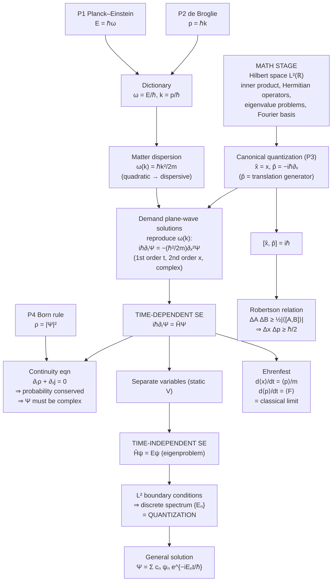

# The Schrödinger Equation — The Full Mathematical Machinery
### Companion volume: now with the mathematics turned all the way up

> [!abstract] Who this is for and how to use it
> This is the rigorous partner to the conceptual note. There I told you the *story*; here I hand you the *apparatus* a theoretician actually carries. Every result is derived, not asserted. Where I invoke a piece of machinery (Hilbert spaces, Fourier transforms, Cauchy–Schwarz) I define it, because a theorist should never treat a tool as a black box.
>
> I still teach the way I always do — motivate before you formalize, and confess every guess honestly. But now the intuition is *scaffolding for the math*, not a replacement for it. Keep a pen next to you. Every $\boxed{\text{box}}$ is a result you should be able to re-derive on demand. Every **Exercise** is a debt you owe yourself.

---

## Part 0 — The single honest sentence, restated with precision

You cannot logically *deduce* quantum mechanics from classical mechanics; there is strictly more information in the quantum theory. What we *can* do is exhibit a **canonical quantization** procedure — a systematic, well-motivated recipe that promotes classical phase-space quantities to operators on a Hilbert space — and show that its simplest realization *is* the Schrödinger equation. The recipe is a **postulate set**, justified a posteriori by experiment. Throughout, I will mark the postulational steps explicitly:

> [!warning] Postulate (P#)
> A statement we *assume*. Not derived. Its warrant is empirical adequacy.

Everything **not** so marked is honest mathematics that follows from those postulates.

---

## Part I — The mathematical stage: states, operators, spectra

Before a single physics symbol, we must know *what kind of objects* we are manipulating. This is where most students stay vague and later drown. We will not be vague.

### I.1 Complex numbers, tightly

A complex number $z = a + ib$, $a,b\in\mathbb{R}$, $i^2=-1$. Its **conjugate** $z^{*}=a-ib$; its **modulus** $|z|=\sqrt{z^{*}z}=\sqrt{a^2+b^2}\ge 0$. Polar form via Euler:
$$z = |z|\,e^{i\arg z},\qquad e^{i\theta}=\cos\theta+i\sin\theta.$$
Prove Euler once from the Taylor series of $e^{i\theta}$, $\cos\theta$, $\sin\theta$ and never doubt it again. The identity $|z|^2 = z^{*}z$ is the reason probabilities (real, non-negative) will be extracted as $\Psi^{*}\Psi$.

### I.2 The conceptual leap: functions *are* vectors

Here is the idea that unlocks the whole formalism. A vector $\mathbf{v}\in\mathbb{C}^n$ is a rule assigning a complex number $v_i$ to each index $i\in\{1,\dots,n\}$. A **function** $\psi:\mathbb{R}\to\mathbb{C}$ is a rule assigning a complex number $\psi(x)$ to each "index" $x\in\mathbb{R}$. **A function is a vector with a continuous index.** Everything you know about finite-dimensional linear algebra survives the passage $i \to x$, $\sum_i \to \int dx$:

$$\text{dot product}\quad \mathbf{u}^{\dagger}\mathbf{v}=\sum_i u_i^{*}v_i \quad\xrightarrow{\;i\to x\;}\quad \langle \phi|\psi\rangle = \int_{-\infty}^{\infty}\phi^{*}(x)\,\psi(x)\,dx.$$

### I.3 Inner product, norm, and $L^2$

> [!info] Definition — inner product
> $$\langle \phi|\psi\rangle \equiv \int_{-\infty}^{\infty}\phi^{*}(x)\psi(x)\,dx.$$
> Properties: conjugate symmetry $\langle\phi|\psi\rangle=\langle\psi|\phi\rangle^{*}$; linearity in the second slot; positivity $\langle\psi|\psi\rangle\ge 0$ with equality iff $\psi\equiv 0$.

The **norm** is $\|\psi\|=\sqrt{\langle\psi|\psi\rangle}$. The physically admissible states are the **square-integrable** functions,
$$L^2(\mathbb{R})=\Big\{\psi:\int_{-\infty}^{\infty}|\psi(x)|^2\,dx<\infty\Big\},$$
because $\int|\psi|^2$ must be finite for the Born rule to make sense (we then rescale to make it $1$). $L^2$ with the above inner product is **complete** (every Cauchy sequence converges within it), which upgrades it to a **Hilbert space** $\mathcal{H}$ — the arena of quantum mechanics.

> [!note] Dirac bra–ket, decoded
> $|\psi\rangle$ ("ket") is the abstract state vector; $\langle\phi|$ ("bra") is the linear functional $\langle\phi|:\;|\psi\rangle\mapsto\langle\phi|\psi\rangle$. In the position representation $|\psi\rangle$ *is* the function $\psi(x)$. Bra–ket is just basis-free linear algebra; the integral is what it looks like in the $x$-basis.

### I.4 Linear operators and the Hermitian condition

An **operator** $\hat{A}:\mathcal{H}\to\mathcal{H}$ maps states to states; **linear** means $\hat{A}(\alpha\psi+\beta\phi)=\alpha\hat A\psi+\beta\hat A\phi$. The **adjoint** $\hat A^{\dagger}$ is defined by
$$\langle\phi|\hat A\psi\rangle=\langle \hat A^{\dagger}\phi|\psi\rangle\qquad\forall\,\phi,\psi.$$
An operator is **Hermitian (self-adjoint)** if $\hat A^{\dagger}=\hat A$. This is not a technicality — it is *the* condition that makes an operator a legitimate observable, for the following reason.

> [!important] Theorem — Hermitian ⇒ real eigenvalues, orthogonal eigenstates
> Let $\hat A\psi_n=a_n\psi_n$. Then
> $$a_n\langle\psi_n|\psi_n\rangle=\langle\psi_n|\hat A\psi_n\rangle=\langle\hat A\psi_n|\psi_n\rangle=a_n^{*}\langle\psi_n|\psi_n\rangle\;\Rightarrow\;a_n=a_n^{*}\in\mathbb{R}.$$
> And for $a_m\neq a_n$, $(a_n-a_m)\langle\psi_m|\psi_n\rangle=0\Rightarrow\langle\psi_m|\psi_n\rangle=0$. Measured values are real; distinct eigenstates are orthogonal. **This is why observables must be Hermitian.**

### I.5 The eigenvalue problem and the spectral idea

$\hat A\psi_n=a_n\psi_n$ says $\hat A$ leaves the direction $\psi_n$ invariant and merely scales it by $a_n$. The set $\{a_n\}$ is the **spectrum**. The Hermitian eigenfunctions form a **complete orthonormal basis**: any state expands as
$$|\psi\rangle=\sum_n c_n|\psi_n\rangle,\qquad c_n=\langle\psi_n|\psi\rangle,$$
(with $\int dp$ replacing $\sum_n$ for continuous spectra). Completeness is the statement $\sum_n|\psi_n\rangle\langle\psi_n|=\hat{\mathbb{1}}$. **Solving the Schrödinger equation will turn out to be exactly this: diagonalize a particular Hermitian operator.** Hold that thought until Part X.

**Exercise I.a.** Show $(\hat A\hat B)^{\dagger}=\hat B^{\dagger}\hat A^{\dagger}$, and that if $\hat A,\hat B$ are Hermitian then $\hat A\hat B$ is Hermitian iff $[\hat A,\hat B]=0$.

---

## Part II — Classical waves, Fourier structure, dispersion

We build the physics on top of the mathematics. Start where everything is safe: classical waves.

### II.1 The classical wave equation and its plane-wave solutions

A non-dispersive classical field (string, sound, light in vacuum) obeys
$$\frac{\partial^2 y}{\partial t^2}=v^2\frac{\partial^2 y}{\partial x^2}.$$
Try $y=e^{i(kx-\omega t)}$. Then $\partial_t^2 y=-\omega^2 y$ and $\partial_x^2 y=-k^2 y$, so the equation demands
$$\omega^2=v^2k^2\quad\Rightarrow\quad \omega=vk.$$
This relation between $\omega$ and $k$ is called the **dispersion relation** $\omega(k)$. Everything about a wave equation's character is encoded in its dispersion relation. Here it is *linear*: $\omega\propto k$. Remember that — matter will violate it, and that violation dictates the form of the Schrödinger equation.

### II.2 Fourier: every state is a superposition of plane waves

Plane waves $e^{ikx}$ are the eigenfunctions of $\partial_x$ (with eigenvalue $ik$), and they are **complete**: any reasonable $\psi(x)$ is a continuous superposition of them. This is the **Fourier transform**:
$$\psi(x)=\frac{1}{\sqrt{2\pi}}\int_{-\infty}^{\infty}\tilde\psi(k)\,e^{ikx}\,dk,\qquad \tilde\psi(k)=\frac{1}{\sqrt{2\pi}}\int_{-\infty}^{\infty}\psi(x)\,e^{-ikx}\,dx.$$
Two facts we will reuse constantly:
- **Orthogonality of plane waves:** $\displaystyle\int_{-\infty}^{\infty}e^{i(k-k')x}\,dx=2\pi\,\delta(k-k')$, where $\delta$ is the Dirac delta.
- **Parseval/Plancherel:** $\displaystyle\int|\psi(x)|^2dx=\int|\tilde\psi(k)|^2dk$ — norm is basis-independent.

### II.3 Phase velocity vs group velocity

A single plane wave moves at the **phase velocity** $v_p=\omega/k$. A localized *packet* — a bump built from a band of $k$'s near some $k_0$ — moves at the **group velocity**
$$\boxed{\,v_g=\left.\frac{d\omega}{dk}\right|_{k_0}\,}$$
Derivation sketch: expand $\omega(k)\approx\omega_0+v_g(k-k_0)$ inside the Fourier integral; the packet's envelope factors out as $f(x-v_g t)$. When $\omega\propto k$ (non-dispersive), $v_p=v_g$ and the packet holds its shape. When $\omega(k)$ is **nonlinear**, $v_p\neq v_g$ and the packet **spreads**. Matter waves are of the second kind — this is why free electrons delocalize over time.

**Exercise II.a.** Derive $v_g=d\omega/dk$ properly by stationary phase: write $\psi(x,t)=\frac{1}{\sqrt{2\pi}}\int \tilde\psi(k)e^{i(kx-\omega(k)t)}dk$ and demand the phase be stationary in $k$.

---

## Part III — The physical inputs and the *matter* dispersion relation

Now two experimental postulates. These are the only genuinely new physics; everything downstream is consequence.

> [!warning] Postulate P1 — Planck–Einstein
> A quantum of the wave carries energy $\;E=\hbar\omega\;$ (equivalently $E=hf$, $\hbar=h/2\pi$).

> [!warning] Postulate P2 — de Broglie
> A particle of momentum $p$ is a wave of wavenumber $\;p=\hbar k\;$ (equivalently $\lambda=h/p$).

These invert to a **dictionary** $\omega=E/\hbar$, $k=p/\hbar$. Feed the *non-relativistic free-particle* energy $E=\dfrac{p^2}{2m}$ through it:

$$\hbar\omega=\frac{(\hbar k)^2}{2m}\quad\Longrightarrow\quad \boxed{\,\omega(k)=\frac{\hbar k^2}{2m}\,}$$

**This is the matter-wave dispersion relation, and it is quadratic in $k$, not linear.** That single fact is about to *force* the entire structure of the Schrödinger equation. Note the beautiful consistency check on group velocity:
$$v_g=\frac{d\omega}{dk}=\frac{\hbar k}{m}=\frac{p}{m}=v_{\text{particle}}.$$
The packet moves at the classical particle speed — exactly as it must if the "particle" is to *be* the packet. (Meanwhile $v_p=\omega/k=\hbar k/2m=v/2$: the individual ripples move at half speed. Harmless — only $v_g$ is observable.)

---

## Part IV — Forging the wave equation *from* the dispersion relation

This is the cleanest, most honest route to the equation, and it is largely rigorous. **We demand an equation whose plane-wave solutions reproduce $\omega=\hbar k^2/2m$.** The recipe is mechanical once you notice how derivatives act on $e^{i(kx-\omega t)}$:

$$i\partial_t\;\longrightarrow\;\omega,\qquad -i\partial_x\;\longrightarrow\;k,\qquad -\partial_x^2\;\longrightarrow\;k^2.$$

(Check: $i\partial_t e^{i(kx-\omega t)}=i(-i\omega)e^{\cdots}=\omega\,e^{\cdots}$, etc.) So to *manufacture* the relation $\omega=\dfrac{\hbar}{2m}k^2$, replace $\omega\to i\partial_t$ and $k^2\to-\partial_x^2$ acting on the wave $\Psi$:

$$i\,\partial_t\Psi=\frac{\hbar}{2m}\big(-\partial_x^2\big)\Psi\quad\Longrightarrow\quad \boxed{\,i\hbar\,\partial_t\Psi=-\frac{\hbar^2}{2m}\partial_x^2\Psi\,}$$

(multiplying by $\hbar$). That is the **free** Schrödinger equation, and every free plane wave with $\omega=\hbar k^2/2m$ solves it *by construction*. Three structural facts fall out immediately, and they are worth stating because they explain "why it looks like that":

1. **First order in $t$, second order in $x$.** Forced by the dispersion relation being *first* power of $\omega$, *second* power of $k$. This asymmetry (unlike the classical wave equation, which is second order in both) is the fingerprint of Schrödinger dynamics.
2. **The $i$ is mandatory.** A quadratic dispersion with first-order time evolution *cannot* be written with real coefficients and still admit oscillatory solutions $e^{i(kx-\omega t)}$; the $i$ on $\partial_t$ is what balances the single time derivative against $k^2$. We will see the same necessity again, independently, from probability conservation (Part VI).
3. **Linearity ⇒ superposition.** The equation is linear in $\Psi$, so sums of solutions are solutions — the entire interference phenomenology is baked in.

### Adding a potential

> [!warning] Postulate P3 — minimal coupling / canonical quantization
> Promote the classical Hamiltonian $H=\dfrac{p^2}{2m}+V(x)$ to an operator by $p\to\hat p=-i\hbar\partial_x$, $x\to\hat x=x$, and demand $i\hbar\partial_t\Psi=\hat H\Psi$.

This gives the full equation:

> [!success] Time-dependent Schrödinger equation (1D)
> $$\boxed{\,i\hbar\,\frac{\partial\Psi}{\partial t}=-\frac{\hbar^2}{2m}\frac{\partial^2\Psi}{\partial x^2}+V(x)\,\Psi\;=\;\hat H\Psi\,}$$

The honest content of P3: for a plane wave in constant $V$ it is *derivable* (just shift $E\to E-V$); its promotion to arbitrary $V(x)$ and arbitrary $\Psi$ is the postulate. Nature ratifies it.

---

## Part V — Canonical quantization done properly: operators & commutators

We introduced $\hat p=-i\hbar\partial_x$ as if by fiat. A theorist wants to see it *arise*. It arises as the **generator of spatial translations**, which is the deep structural reason it is what it is.

### V.1 Momentum as the generator of translations

Let $\hat T(a)$ translate a state by $a$: $[\hat T(a)\psi](x)=\psi(x-a)$. Taylor-expand:
$$\psi(x-a)=\sum_{n=0}^{\infty}\frac{(-a)^n}{n!}\frac{d^n\psi}{dx^n}=\exp\!\Big(-a\frac{d}{dx}\Big)\psi(x).$$
So $\hat T(a)=e^{-a\,\partial_x}$. Physics *defines* momentum as the generator of translations via $\hat T(a)=e^{-i a\hat p/\hbar}$. Matching exponents:
$$-\frac{i a}{\hbar}\hat p=-a\,\partial_x\quad\Longrightarrow\quad\boxed{\,\hat p=-i\hbar\,\partial_x\,}$$
Not an arbitrary choice — it is the unique operator whose exponential shifts position. The factor $-i\hbar$ makes $\hat p$ Hermitian (check below) and gives $\hat T$ unitary.

**Exercise V.a.** Show $\hat p=-i\hbar\partial_x$ is Hermitian on $L^2$: integrate $\int\phi^{*}(-i\hbar\partial_x)\psi\,dx$ by parts and use that boundary terms vanish for $L^2$ functions.

### V.2 The canonical commutation relation

The single most important algebraic fact in quantum mechanics. Act on a test function:
$$[\hat x,\hat p]\psi=x(-i\hbar\psi')-(-i\hbar)(x\psi)'=-i\hbar x\psi'+i\hbar(\psi+x\psi')=i\hbar\psi.$$
Therefore
$$\boxed{\,[\hat x,\hat p]=i\hbar\,}$$
This is **the** structural core. It says position and momentum cannot be simultaneously diagonalized; it will directly produce the uncertainty principle in Part IX; and it is the quantum shadow of the classical Poisson bracket $\{x,p\}=1$ (Dirac's correspondence $\{\cdot,\cdot\}\to\frac{1}{i\hbar}[\cdot,\cdot]$).

### V.3 The Hamiltonian operator

$$\hat H=\frac{\hat p^2}{2m}+V(\hat x)=-\frac{\hbar^2}{2m}\partial_x^2+V(x),$$
Hermitian provided $V$ is real. It is both the observable "total energy" and the generator of time translation (that is the entire content of $i\hbar\partial_t\Psi=\hat H\Psi$: $\hat H$ pushes the state forward in time exactly as $\hat p$ pushes it through space).

---

## Part VI — Probability: the Born rule and the continuity equation

Now we install the interpretation and prove it is *consistent* — that total probability is conserved by the dynamics. This is where the necessity of a complex $\Psi$ becomes a theorem, not a slogan.

> [!warning] Postulate P4 — Born rule
> $\rho(x,t)=|\Psi(x,t)|^2=\Psi^{*}\Psi$ is the probability density; $\int_{-\infty}^{\infty}\rho\,dx=1$.

For this to be *maintainable*, $\frac{d}{dt}\int\rho\,dx$ must vanish. Let's prove it does, and in doing so discover the probability current.

**Derivation of the continuity equation.** Write the Schrödinger equation and its complex conjugate ($V$ real):
$$\partial_t\Psi=\frac{i\hbar}{2m}\partial_x^2\Psi-\frac{i}{\hbar}V\Psi,\qquad \partial_t\Psi^{*}=-\frac{i\hbar}{2m}\partial_x^2\Psi^{*}+\frac{i}{\hbar}V\Psi^{*}.$$
Then
$$\partial_t\rho=\Psi^{*}\partial_t\Psi+\Psi\,\partial_t\Psi^{*}
=\frac{i\hbar}{2m}\big(\Psi^{*}\partial_x^2\Psi-\Psi\,\partial_x^2\Psi^{*}\big),$$
where the $V$-terms **cancel exactly** (this cancellation is why $V$ must be real — imaginary potentials leak probability, which is sometimes used deliberately to model absorption). Now recognize a total derivative:
$$\Psi^{*}\partial_x^2\Psi-\Psi\,\partial_x^2\Psi^{*}=\partial_x\big(\Psi^{*}\partial_x\Psi-\Psi\,\partial_x\Psi^{*}\big).$$
Hence $\partial_t\rho=-\partial_x j$ with

> [!success] Continuity equation and probability current
> $$\boxed{\,\frac{\partial\rho}{\partial t}+\frac{\partial j}{\partial x}=0,\qquad j=\frac{\hbar}{2mi}\big(\Psi^{*}\partial_x\Psi-\Psi\,\partial_x\Psi^{*}\big)=\frac{\hbar}{m}\,\mathrm{Im}\big(\Psi^{*}\partial_x\Psi\big)\,}$$

Integrate over all space: $\frac{d}{dt}\int\rho\,dx=-[\,j\,]_{-\infty}^{\infty}=0$ for $L^2$ states. **Probability is conserved.** The Born rule is dynamically consistent.

> [!important] The rigorous proof that $\Psi$ must be complex
> For a **real** $\Psi$, $\mathrm{Im}(\Psi^{*}\partial_x\Psi)=\mathrm{Im}(\Psi\,\Psi')=0$, so $j\equiv 0$ everywhere. A real wavefunction transports *no probability* — it can never describe a particle in motion. Since particles demonstrably move, $\Psi$ must be genuinely complex. This is not an aesthetic choice; it is forced by the structure of probability flow.

**Exercise VI.a.** For a plane wave $\Psi=A e^{i(kx-\omega t)}$ show $\rho=|A|^2$ and $j=|A|^2\,\hbar k/m=\rho\,v$. Interpret $j=\rho v$ as "current = density × velocity," exactly as in fluid flow.

---

## Part VII — Observables, expectation values, and dynamics of averages

### VII.1 Expectation values

The average of many measurements of observable $\hat Q$ on identically prepared states $\Psi$:
$$\langle \hat Q\rangle=\int\Psi^{*}\hat Q\,\Psi\,dx=\langle\Psi|\hat Q|\Psi\rangle.$$
Hermiticity of $\hat Q$ guarantees $\langle\hat Q\rangle\in\mathbb{R}$ (Part I.4). Examples:
$$\langle\hat x\rangle=\int\Psi^{*}x\Psi\,dx,\qquad \langle\hat p\rangle=\int\Psi^{*}(-i\hbar\partial_x)\Psi\,dx.$$

### VII.2 The general equation of motion for an average

Differentiate $\langle\hat Q\rangle$ using the Schrödinger equation for $\partial_t\Psi$ and $\partial_t\Psi^{*}$:
$$\frac{d}{dt}\langle\hat Q\rangle=\Big\langle\frac{\partial\hat Q}{\partial t}\Big\rangle+\frac{i}{\hbar}\big\langle[\hat H,\hat Q]\big\rangle.$$

> [!info] Derivation
> $\frac{d}{dt}\langle Q\rangle=\int(\partial_t\Psi^{*})Q\Psi+\Psi^{*}(\partial_t Q)\Psi+\Psi^{*}Q(\partial_t\Psi)\,dx$. Insert $\partial_t\Psi=\frac{1}{i\hbar}\hat H\Psi$ and $\partial_t\Psi^{*}=-\frac{1}{i\hbar}(\hat H\Psi)^{*}$, use Hermiticity of $\hat H$ to move it onto $Q\Psi$, and collect terms into the commutator.

This master formula says: **observables with no explicit time dependence that commute with $\hat H$ are conserved.** Energy conservation is the trivial case $\hat Q=\hat H$.

### VII.3 Ehrenfest's theorem — classical mechanics as the average

Apply the master formula to $\hat x$ and $\hat p$ (both time-independent). Compute the commutators with $\hat H=\frac{\hat p^2}{2m}+V$:
$$[\hat H,\hat x]=\frac{1}{2m}[\hat p^2,\hat x]=\frac{1}{2m}\big(\hat p[\hat p,\hat x]+[\hat p,\hat x]\hat p\big)=\frac{1}{2m}(2\hat p)(-i\hbar)=-\frac{i\hbar}{m}\hat p,$$
$$[\hat H,\hat p]=[V(\hat x),\hat p]=i\hbar\,V'(\hat x)\quad(\text{since }[\hat x,\hat p]=i\hbar\Rightarrow[f(\hat x),\hat p]=i\hbar f'(\hat x)).$$
Therefore
$$\boxed{\;\frac{d\langle\hat x\rangle}{dt}=\frac{\langle\hat p\rangle}{m},\qquad \frac{d\langle\hat p\rangle}{dt}=-\big\langle V'(\hat x)\big\rangle=\langle F\rangle\;}$$
These are **Newton's laws for the expectation values.** Quantum mechanics *contains* classical mechanics as the dynamics of its averages; the classical trajectory is recovered when the packet is narrow enough that $\langle V'(\hat x)\rangle\approx V'(\langle\hat x\rangle)$. This is the precise sense in which the correspondence principle holds.

---

## Part VIII — Position and momentum space: Fourier duality

Because $\{e^{ipx/\hbar}\}$ diagonalizes $\hat p$, the Fourier transform *is* the change of basis from position to momentum. Use the $\hbar$-symmetric convention:
$$\Psi(x,t)=\frac{1}{\sqrt{2\pi\hbar}}\int\tilde\Psi(p,t)\,e^{ipx/\hbar}\,dp,\qquad \tilde\Psi(p,t)=\frac{1}{\sqrt{2\pi\hbar}}\int\Psi(x,t)\,e^{-ipx/\hbar}\,dx.$$
Then $|\tilde\Psi(p)|^2$ is the probability density **in momentum**, and by Plancherel $\int|\Psi|^2dx=\int|\tilde\Psi|^2dp$ (total probability is the same in both pictures). The momentum eigenstates
$$u_p(x)=\frac{1}{\sqrt{2\pi\hbar}}\,e^{ipx/\hbar},\qquad \langle u_{p}|u_{p'}\rangle=\delta(p-p'),$$
are **delta-normalized** — they live outside $L^2$ (infinite norm), the price of a continuous spectrum. They are idealizations you superpose into genuine $L^2$ packets. In this basis $\hat p$ acts by *multiplication* by $p$, and $\hat x$ acts as $+i\hbar\partial_p$ — the dual of the position-space rule, as the symmetry of $[\hat x,\hat p]=i\hbar$ demands.

**Exercise VIII.a.** Verify $\langle u_p|u_{p'}\rangle=\delta(p-p')$ using $\int e^{i(p-p')x/\hbar}dx=2\pi\hbar\,\delta(p-p')$.

---

## Part IX — The uncertainty principle, derived (Robertson relation)

Not a measurement-disturbance story — a **theorem** about the spread of any two observables in any state, straight from the inner-product geometry.

Define the spread (standard deviation) of Hermitian $\hat A$ in state $\Psi$ via the mean-shifted operator $\delta\hat A=\hat A-\langle\hat A\rangle$:
$$(\Delta A)^2=\langle(\delta\hat A)^2\rangle=\|\,\delta\hat A\,\Psi\,\|^2.$$
Set $f=\delta\hat A\,\Psi$ and $g=\delta\hat B\,\Psi$. Then $(\Delta A)^2=\langle f|f\rangle$, $(\Delta B)^2=\langle g|g\rangle$.

**Step 1 — Cauchy–Schwarz.** For any vectors, $\langle f|f\rangle\langle g|g\rangle\ge|\langle f|g\rangle|^2$. Hence
$$(\Delta A)^2(\Delta B)^2\ge|\langle f|g\rangle|^2.$$

**Step 2 — keep the imaginary part.** For any complex $z$, $|z|^2\ge(\mathrm{Im}\,z)^2=\big(\tfrac{1}{2i}(z-z^{*})\big)^2$. With $z=\langle f|g\rangle$, and using Hermiticity to write $\langle f|g\rangle=\langle\Psi|\delta\hat A\,\delta\hat B|\Psi\rangle$, $\langle g|f\rangle=\langle\Psi|\delta\hat B\,\delta\hat A|\Psi\rangle$:
$$z-z^{*}=\langle[\delta\hat A,\delta\hat B]\rangle=\langle[\hat A,\hat B]\rangle$$
(the $\langle A\rangle,\langle B\rangle$ c-numbers cancel in the commutator). Therefore
$$|\langle f|g\rangle|^2\ge\Big(\frac{1}{2i}\langle[\hat A,\hat B]\rangle\Big)^2.$$

**Step 3 — assemble.**
$$\boxed{\;\Delta A\,\Delta B\ \ge\ \frac{1}{2}\big|\langle[\hat A,\hat B]\rangle\big|\;}\qquad(\textbf{Robertson uncertainty relation})$$

Now specialize with the one relation that runs the whole theory, $[\hat x,\hat p]=i\hbar$:
$$\boxed{\;\Delta x\,\Delta p\ \ge\ \frac{\hbar}{2}\;}$$
The uncertainty principle is a **corollary of the commutator**, which was itself a corollary of momentum being the translation generator. Everything hangs together. Equality holds iff $g\propto f$ with an imaginary constant — which forces a **Gaussian** state, our next topic.

---

## Part X — The time-independent equation, stationary states, and general evolution

### X.1 Separation of variables (rigorous)

When $V=V(x)$ has no explicit time dependence, seek solutions $\Psi(x,t)=\psi(x)\,T(t)$. Substitute and divide by $\psi T$:
$$i\hbar\frac{T'(t)}{T(t)}=\frac{1}{\psi(x)}\Big(-\frac{\hbar^2}{2m}\psi''(x)+V(x)\psi(x)\Big).$$
LHS depends only on $t$, RHS only on $x$; equality for all $(x,t)$ forces both to a common constant $E$. The time factor integrates immediately:
$$T(t)=e^{-iEt/\hbar},$$
and the space factor obeys

> [!success] Time-independent Schrödinger equation
> $$\boxed{\;-\frac{\hbar^2}{2m}\frac{d^2\psi}{dx^2}+V(x)\psi=E\psi\quad\Longleftrightarrow\quad \hat H\psi=E\psi\;}$$

This is precisely the **eigenvalue problem** of Part I.5 for the Hermitian operator $\hat H$. "Solving quantum mechanics for a given potential" = "finding the spectrum and eigenfunctions of $\hat H$." The solutions $\Psi_n=\psi_n(x)e^{-iE_nt/\hbar}$ are **stationary states**: $\rho_n=|\psi_n|^2$ is time-independent (the time dependence is a pure phase).

### X.2 Quantization from boundary conditions — where the discreteness lives

For a bound particle we require $\psi\in L^2$: normalizable, hence $\psi\to0$ as $|x|\to\infty$ (plus continuity of $\psi,\psi'$ wherever $V$ is finite). Generic $E$ yields solutions that diverge exponentially and fail normalizability; only a **discrete set** $\{E_n\}$ admits admissible $\psi_n$. **Quantization is a boundary-value phenomenon** — the exact analogue of a vibrating string admitting only harmonics that fit its clamped ends. No new postulate is needed; the discreteness is forced by $L^2$ membership.

### X.3 The general solution

Because $\hat H$ is Hermitian, $\{\psi_n\}$ is a complete orthonormal set, so the *general* solution of the time-dependent equation is the superposition of stationary states with their individual phases:
$$\boxed{\;\Psi(x,t)=\sum_n c_n\,\psi_n(x)\,e^{-iE_nt/\hbar},\qquad c_n=\langle\psi_n|\Psi(\cdot,0)\rangle\;}$$
Everything dynamical reduces to: (1) diagonalize $\hat H$ once, (2) project the initial state onto the eigenbasis to get $\{c_n\}$, (3) let each mode rotate at its own frequency $E_n/\hbar$. That is the entire content of non-relativistic quantum dynamics for a static potential. $|c_n|^2$ is the probability of measuring energy $E_n$, and $\sum|c_n|^2=1$ by orthonormality.

**Exercise X.a.** Show $\langle\hat H\rangle=\sum_n|c_n|^2E_n$ is time-independent, and that interference between modes appears in $\langle\hat x\rangle(t)$ through cross terms oscillating at the **Bohr frequencies** $(E_n-E_m)/\hbar$.

---

## Part XI — Fully worked example: the free Gaussian wave packet

This single example exercises Fourier duality, minimum uncertainty, and dispersive spreading — a rite of passage. Take $V=0$.

### XI.1 The one integral you must own

$$\int_{-\infty}^{\infty}e^{-\alpha x^2+\beta x}\,dx=\sqrt{\frac{\pi}{\alpha}}\;e^{\beta^2/4\alpha}\qquad(\mathrm{Re}\,\alpha>0).$$
Everything Gaussian follows from completing the square inside this.

### XI.2 The initial state and its momentum content

Take a minimum-uncertainty packet centered at $x=0$ with mean momentum $\hbar k_0$:
$$\psi(x,0)=\Big(\frac{1}{2\pi\sigma^2}\Big)^{1/4}\exp\!\Big(-\frac{x^2}{4\sigma^2}\Big)e^{ik_0x}.$$
Then $\rho(x,0)=|\psi|^2=(2\pi\sigma^2)^{-1/2}e^{-x^2/2\sigma^2}$, a Gaussian with $\boxed{\Delta x=\sigma}$. Fourier transform to momentum space (apply XI.1):
$$\tilde\psi(k,0)\propto\exp\!\big(-\sigma^2(k-k_0)^2\big)\;\Rightarrow\;|\tilde\psi(k)|^2\propto e^{-2\sigma^2(k-k_0)^2},$$
a Gaussian in $k$ centered at $k_0$ with $\Delta k=\dfrac{1}{2\sigma}$, i.e. $\boxed{\Delta p=\hbar\Delta k=\dfrac{\hbar}{2\sigma}}$. Multiply:
$$\Delta x\,\Delta p=\sigma\cdot\frac{\hbar}{2\sigma}=\frac{\hbar}{2}.$$
The Gaussian **saturates** the Robertson bound — it is the minimum-uncertainty state, exactly as Part IX predicted.

### XI.3 Time evolution and spreading

Each momentum component evolves by its phase $e^{-i\hbar k^2 t/2m}$ (free dispersion). Reassembling the integral (again XI.1, now with complex $\alpha$) gives a Gaussian whose width grows:
$$\boxed{\;\sigma(t)=\sigma\sqrt{1+\Big(\frac{\hbar t}{2m\sigma^2}\Big)^2}\;}$$
The center moves at $v_g=\hbar k_0/m$ (Ehrenfest), while the packet **spreads** because $\omega(k)\propto k^2$ is dispersive — the very nonlinearity we flagged in Part II. Sharper initial localization (small $\sigma$) ⇒ broader momentum spread ⇒ *faster* spreading. You are watching the uncertainty principle unfold in time.

```
   |Ψ|²
    ▲     t = 0          t = t₁            t = t₂ > t₁
    │      ╱╲              ╱ ╲                ╱   ╲
    │     ╱  ╲            ╱   ╲              ╱     ╲
    │    ╱    ╲          ╱     ╲           ╱        ╲
    │   ╱      ╲       ╱        ╲        ╱           ╲
    └──┴────────┴─────┴──────────┴─────┴─────────────┴──▶ x
       tall & narrow   moved & wider    moved more & flatter
       (area = 1 always: probability is conserved — Part VI)
```

**Exercise XI.a.** Carry out §XI.3 explicitly: write $\psi(x,t)=\frac{1}{\sqrt{2\pi}}\int\tilde\psi(k,0)e^{i(kx-\hbar k^2t/2m)}dk$, complete the square, and read off $\sigma(t)$. Confirm $\int|\psi(x,t)|^2dx=1$ for all $t$.

---

## Part XII — The whole logical architecture on one screen



---

## Part XIII — Master results (your one-page reference)

**States & inner product**
$$\Psi\in L^2(\mathbb{R}),\quad \langle\phi|\psi\rangle=\int\phi^{*}\psi\,dx,\quad \int|\Psi|^2dx=1.$$

**Core operators**
$$\hat x=x,\quad \hat p=-i\hbar\partial_x,\quad \hat H=-\frac{\hbar^2}{2m}\partial_x^2+V,\quad [\hat x,\hat p]=i\hbar.$$

**Dynamics**
$$i\hbar\,\partial_t\Psi=\hat H\Psi\quad\text{(time-dependent)},\qquad \hat H\psi_n=E_n\psi_n\quad\text{(time-independent)}.$$

**General solution**
$$\Psi(x,t)=\sum_n c_n\psi_n(x)e^{-iE_nt/\hbar},\quad c_n=\langle\psi_n|\Psi(0)\rangle,\quad \sum_n|c_n|^2=1.$$

**Probability flow**
$$\partial_t\rho+\partial_x j=0,\quad j=\frac{\hbar}{m}\mathrm{Im}(\Psi^{*}\partial_x\Psi).$$

**Averages & their motion**
$$\langle\hat Q\rangle=\langle\Psi|\hat Q|\Psi\rangle,\quad \frac{d}{dt}\langle\hat Q\rangle=\Big\langle\frac{\partial\hat Q}{\partial t}\Big\rangle+\frac{i}{\hbar}\langle[\hat H,\hat Q]\rangle.$$

**Uncertainty**
$$\Delta A\,\Delta B\ge\tfrac12|\langle[\hat A,\hat B]\rangle|\;\Rightarrow\;\Delta x\,\Delta p\ge\frac{\hbar}{2}.$$

---

## Part XIV — Glossary of mathematical objects

| Object | Symbol | Definition / role |
|---|---|---|
| Hilbert space | $\mathcal{H}=L^2(\mathbb{R})$ | complete inner-product space of square-integrable states |
| inner product | $\langle\phi|\psi\rangle$ | $\int\phi^{*}\psi\,dx$; geometry of state space |
| norm | $\|\psi\|$ | $\sqrt{\langle\psi|\psi\rangle}$; $=1$ after normalization |
| ket / bra | $|\psi\rangle,\langle\phi|$ | abstract state / its dual linear functional |
| operator | $\hat A$ | linear map $\mathcal H\to\mathcal H$ |
| adjoint | $\hat A^{\dagger}$ | defined by $\langle\phi|\hat A\psi\rangle=\langle\hat A^{\dagger}\phi|\psi\rangle$ |
| Hermitian | $\hat A^{\dagger}=\hat A$ | observables; real eigenvalues, orthogonal eigenstates |
| commutator | $[\hat A,\hat B]$ | $\hat A\hat B-\hat B\hat A$; measures incompatibility |
| eigenvalue problem | $\hat A\psi_n=a_n\psi_n$ | invariant directions & measured values |
| spectrum | $\{a_n\}$ | set of possible measurement outcomes |
| completeness | $\sum_n|\psi_n\rangle\langle\psi_n|=\hat{\mathbb 1}$ | any state expands in the eigenbasis |
| Fourier transform | $\tilde\psi(k)$ | change of basis to plane waves / momentum |
| Dirac delta | $\delta(x)$ | continuous-index orthonormality; $\int\delta=1$ |
| dispersion relation | $\omega(k)$ | wave "constitution"; matter: $\hbar k^2/2m$ |
| phase / group velocity | $v_p,v_g$ | $\omega/k$ / $d\omega/dk$; the packet moves at $v_g$ |
| probability current | $j$ | flux of $|\Psi|^2$; $j=\rho v$ for plane waves |
| Hamiltonian | $\hat H$ | total-energy operator = generator of time evolution |
| stationary state | $\psi_n e^{-iE_nt/\hbar}$ | definite-energy state; $|\Psi|^2$ time-independent |

---

## Part XV — Prove-it-to-yourself problem set

Do these with a pen. If you can clear them, you own this material at theory-track depth.

1. **Hermiticity of $\hat p$.** Prove $\langle\phi|\hat p\psi\rangle=\langle\hat p\phi|\psi\rangle$ on $L^2$, identifying the boundary term you discard and why it vanishes.
2. **General commutator identity.** Prove $[f(\hat x),\hat p]=i\hbar f'(\hat x)$ and $[\hat x,g(\hat p)]=i\hbar g'(\hat p)$.
3. **Current of a superposition.** For $\Psi=a\,e^{i(kx-\omega t)}+b\,e^{i(-kx-\omega t)}$ compute $\rho$ and $j$; interpret the interference cross-terms.
4. **Virial-type check.** Using Ehrenfest, show that for a stationary state $\frac{d}{dt}\langle\hat x\rangle=0$ and $\langle\hat p\rangle=0$.
5. **Minimum uncertainty ⇒ Gaussian.** Show the equality $\Delta x\,\Delta p=\hbar/2$ forces $(\hat p-\langle p\rangle)\psi=i\lambda(\hat x-\langle x\rangle)\psi$ for real $\lambda$, and solve this ODE to recover the Gaussian of Part XI.
6. **Free spreading.** Complete Exercise XI.a and extract $\sigma(t)$; find the time at which the packet has doubled its width.
7. **Energy measurement statistics.** For $\Psi=\frac{1}{\sqrt2}(\psi_1+\psi_2)$ (two eigenstates), compute $\langle\hat H\rangle$, $\Delta H$, and the period of oscillation in $\langle\hat x\rangle(t)$.

> [!quote] The professor's parting word
> Notice what actually happened in this document. We assumed almost nothing — a Hilbert space, two experimental relations, a Born rule, and one quantization instruction — and out of it fell *all* of single-particle quantum mechanics: the equation, its complex nature, conservation of probability, the uncertainty principle, quantization, and the classical limit. That economy is not an accident; it is the signature of a *correct* theory. When a handful of well-chosen postulates forces this much structure, and the structure then matches ten decimal places of experiment, you are not looking at a convenient fiction — you are looking at how the world is put together. Your job now is not to believe it. Your job is to *rederive it*, alone, on a blank page, until it is yours. Then go compute a hydrogen atom, and watch the periodic table fall out of an eigenvalue problem.
