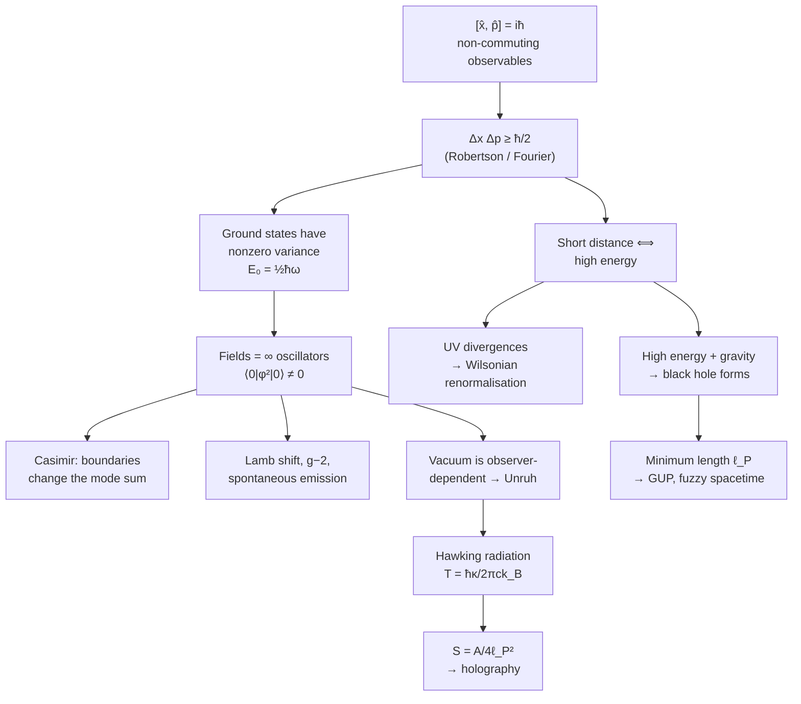

# Uncertainty From Scratch

> [!abstract] How to read this note
> This is built the same way as [[Navier-Stokes-From-Scratch]]: nothing appears before the idea it encodes, and every symbol is defined twice.
>
> **Part I** derives the uncertainty principle properly and then spends a lot of effort telling you what it is *not*. That second half matters more than the first, because almost everything you've read about uncertainty in popular science is subtly wrong, and the wrongness propagates straight into the exotic topics.
>
> **Part II** is quantum field theory. **Part III** is black holes. **Part IV** is the speculative frontier.
>
> Throughout, I've marked claims by how much we actually know. There's a confidence ladder in §16. Look at it early if you're impatient.

---

## 0. The thing nobody tells you first

Let me start with a confession that will make the rest of this much easier.

**The uncertainty principle is not, at its core, a quantum mechanical statement.** It is a theorem about waves. It was known to radio engineers and acousticians before Heisenberg was born, under the name the *bandwidth theorem*. Quantum mechanics contributes exactly one physical ingredient to it, and I'll show you precisely where that ingredient enters.

Here's the wave fact. Take a sound. If you want to know its pitch very precisely, you need to listen to it for a long time — a pure tone is an infinitely long sine wave. If instead you want to know exactly *when* it happened, you need a sharp click — and a click has no pitch at all, it contains every frequency at once.

```
   A long pure tone:              ~~~~~~~~~~~~~~~~~~~~~~~~
   sharp in frequency             |
   vague in time                  └─ frequency spectrum:  ▌  (one spike)


   A sharp click:                 ────────┃────────────────
   sharp in time                  |
   vague in frequency             └─ frequency spectrum: ▁▃▅▇▇▇▅▃▁ (everything)
```

You cannot have both. Not because your equipment is bad. Because *"a short signal with a single frequency"* is a self-contradictory description of a wave, in the same way that *"a square circle"* is a self-contradictory description of a shape. There is nothing to build, and nothing to measure.

That is the entire content of the uncertainty principle. Everything else is conversion of units.

> [!important] The one-line summary
> Quantum mechanics says matter is described by waves, and that a particle's momentum *is* the wave's spatial frequency (times $\hbar$). Once you accept those two things, the uncertainty principle follows from pure mathematics, with no further physics.
>
> It is not about clumsy measurement. It is not about the observer. It is not about our ignorance. It is a statement that **the question you're asking doesn't have an answer**, because the object you're asking about doesn't have the property you're assuming it has.

Hold on to this. In Part II and III you'll meet people saying "the uncertainty principle lets the vacuum borrow energy" and "the uncertainty principle creates particles at the event horizon." Those sentences are doing something quite different from what they appear to, and by the end you'll be able to say exactly what.

---

# PART I — THE PRINCIPLE ITSELF

## 1. Toolkit

### 1.1 The objects

| Symbol | Name | What it is |
|---|---|---|
| $\lvert\psi\rangle$ | state vector / ket | a vector in a complex Hilbert space $\mathcal{H}$; the complete description of a system |
| $\langle\psi\rvert$ | bra | the dual (conjugate transpose) of $\lvert\psi\rangle$ |
| $\langle\phi\vert\psi\rangle$ | inner product | a complex number; $\langle\phi\vert\psi\rangle = \overline{\langle\psi\vert\phi\rangle}$ |
| $\psi(x) = \langle x\vert\psi\rangle$ | wavefunction | the state expressed in the position basis |
| $\hat{A}$ | operator | a linear map $\mathcal{H}\to\mathcal{H}$; observables are **Hermitian**, $\hat{A}^\dagger = \hat{A}$ |
| $\hbar$ | reduced Planck constant | $1.0546\times10^{-34}$ J·s. The conversion factor between "wave" language and "particle" language. |

**Born rule:** if you measure $\hat{A}$ on state $\lvert\psi\rangle$, you get one of its eigenvalues $a_n$ with probability $\lvert\langle a_n\vert\psi\rangle\rvert^2$.

**Expectation value:** the average over many repetitions,
$$\langle \hat{A}\rangle = \langle\psi\rvert \hat{A}\lvert\psi\rangle.$$

**Standard deviation** — and this is the $\Delta$ in every uncertainty relation:
$$\sigma_A \equiv \Delta A = \sqrt{\langle \hat{A}^2\rangle - \langle \hat{A}\rangle^2} = \sqrt{\big\langle (\hat{A}-\langle \hat{A}\rangle)^2\big\rangle}.$$

> [!warning] $\Delta x$ is a statistical spread, not an error bar
> This trips up everyone. $\Delta x$ is **not** the precision of your ruler. It is the standard deviation of the results you'd get if you prepared the *same* state a million times and measured position each time, each measurement being arbitrarily precise.
>
> Uncertainty is a property of the **state**, not of the apparatus. Say that to yourself twice.

### 1.2 Commutators

Operators are matrices, and matrices generally don't commute: $\hat{A}\hat{B}\neq\hat{B}\hat{A}$. Define

$$[\hat{A},\hat{B}] \equiv \hat{A}\hat{B}-\hat{B}\hat{A}.$$

Properties you'll use: $[\hat{A},\hat{B}] = -[\hat{B},\hat{A}]$, and if $\hat{A},\hat{B}$ are Hermitian then $[\hat{A},\hat{B}]$ is **anti**-Hermitian, so $\langle[\hat{A},\hat{B}]\rangle$ is purely **imaginary**. (Remember that — it's the crux of the derivation.)

**The canonical commutation relation.** In the position representation, $\hat{x}\psi(x) = x\psi(x)$ and $\hat{p}\psi(x) = -i\hbar\,\partial_x\psi(x)$. Apply both orders to a test function:

$$[\hat{x},\hat{p}]\psi = x(-i\hbar\psi') - (-i\hbar)\partial_x(x\psi) = -i\hbar x\psi' + i\hbar(\psi + x\psi') = i\hbar\psi$$

$$\boxed{\ [\hat{x},\hat{p}] = i\hbar\ }$$

This single equation is the seed of everything in this document. Every uncertainty relation, the vacuum energy, the Casimir force, the minimum length — all of it grows out of this one line, or out of some deformation of it.

Two operators **commute** $\iff$ they share a complete set of eigenvectors $\iff$ there exist states with definite values of both. Since $[\hat{x},\hat{p}]=i\hbar\neq0$, **no state has both a definite position and a definite momentum.** Not "we can't find out" — there is no such state in the space.

---

## 2. The classical theorem: Fourier

Before any quantum mechanics, let's prove the hard part.

Let $f(x)$ be any square-integrable function with Fourier transform
$$\tilde{f}(k) = \frac{1}{\sqrt{2\pi}}\int_{-\infty}^{\infty} f(x)\,e^{-ikx}dx.$$

Treat $\lvert f\rvert^2$ and $\lvert\tilde f\rvert^2$ as probability densities (normalise them) and define their spreads $\Delta x$, $\Delta k$. Then

$$\boxed{\ \Delta x\,\Delta k \ \ge\ \tfrac12\ }$$

**This is a theorem about functions. No physics in it at all.** A narrow function has a broad transform; that's what transforms do. Equality holds only for Gaussians — which is why Gaussian wave packets are called *minimum uncertainty states*.

Intuition without algebra: to build a bump localised in a region of width $\Delta x$, you superpose plane waves. Waves must reinforce inside the bump and cancel outside. Cancellation over a distance $\Delta x$ requires components whose phases drift apart by about $2\pi$ across it — i.e. a spread of wavenumbers $\Delta k\sim1/\Delta x$. Narrower bump, more cancellation needed, wider spread of $k$. That's the whole mechanism.

### 2.1 The one physical input

Now quantum mechanics enters, and it enters exactly once:

> [!important] de Broglie
> $$p = \hbar k$$
> A particle's momentum *is* its matter-wave's spatial frequency, scaled by $\hbar$.

Multiply the Fourier theorem by $\hbar$:

$$\Delta x\,\Delta(\hbar k) \ge \frac{\hbar}{2}\qquad\Longrightarrow\qquad \boxed{\ \Delta x\,\Delta p\ \ge\ \frac{\hbar}{2}\ }$$

Done. That's Heisenberg.

So the honest accounting is: **99% mathematics (Fourier), 1% physics ($p=\hbar k$).** The 1% is what makes it about nature rather than about signal processing. But the inequality itself was never in doubt.

---

## 3. The general case: Robertson's derivation

Let's do it properly for arbitrary observables, because the general result is what the exotic topics need.

**Setup.** Let $\hat{A},\hat{B}$ be Hermitian, $\lvert\psi\rangle$ normalised. Define the centred operators
$$\delta\hat{A} = \hat{A}-\langle \hat{A}\rangle,\qquad \delta\hat{B}=\hat{B}-\langle \hat{B}\rangle,$$
and the two vectors
$$\lvert f\rangle = \delta\hat{A}\lvert\psi\rangle,\qquad \lvert g\rangle=\delta\hat{B}\lvert\psi\rangle.$$

Note $\langle f\vert f\rangle = \langle\delta\hat{A}^2\rangle = \sigma_A^2$ and likewise $\langle g\vert g\rangle = \sigma_B^2$.

**Step 1 — Cauchy–Schwarz.** For any two vectors,
$$\langle f\vert f\rangle\,\langle g\vert g\rangle \ \ge\ \lvert\langle f\vert g\rangle\rvert^2
\qquad\Longrightarrow\qquad
\sigma_A^2\sigma_B^2 \ge \lvert\langle \delta\hat{A}\,\delta\hat{B}\rangle\rvert^2.$$

(Geometrically this is just $\lvert\cos\theta\rvert\le1$. Nothing deep.)

**Step 2 — split the product into real and imaginary parts.** Any product of operators splits as
$$\delta\hat{A}\,\delta\hat{B} = \underbrace{\tfrac12\{\delta\hat{A},\delta\hat{B}\}}_{\text{Hermitian}\ \Rightarrow\ \text{real expectation}} + \underbrace{\tfrac12[\delta\hat{A},\delta\hat{B}]}_{\text{anti-Hermitian}\ \Rightarrow\ \text{imaginary expectation}}$$
where $\{\cdot,\cdot\}$ is the anticommutator $\hat{A}\hat{B}+\hat{B}\hat{A}$.

**Step 3 — for any complex number, $\lvert z\rvert^2 = (\mathrm{Re}\,z)^2+(\mathrm{Im}\,z)^2 \ge (\mathrm{Im}\,z)^2$.** Throw away the real part:

$$\sigma_A^2\sigma_B^2 \ \ge\ \left\lvert\tfrac12\langle[\delta\hat{A},\delta\hat{B}]\rangle\right\rvert^2.$$

**Step 4 — the constants drop out**: $[\delta\hat{A},\delta\hat{B}]=[\hat{A},\hat{B}]$, since commutators annihilate c-numbers. Take the square root:

> [!important] Robertson uncertainty relation (1929)
> $$\boxed{\ \sigma_A\,\sigma_B\ \ge\ \frac{1}{2}\left\lvert\big\langle[\hat{A},\hat{B}]\big\rangle\right\rvert\ }$$
>
> Keeping the discarded term gives the sharper **Schrödinger relation**:
> $$\sigma_A^2\sigma_B^2 \ge \left(\tfrac12\langle\{\delta\hat A,\delta\hat B\}\rangle\right)^2 + \left(\tfrac{1}{2i}\langle[\hat A,\hat B]\rangle\right)^2.$$

Put $\hat{A}=\hat{x}$, $\hat{B}=\hat{p}$, $[\hat{x},\hat{p}]=i\hbar$:

$$\sigma_x\sigma_p \ge \tfrac12\lvert i\hbar\rvert = \frac{\hbar}{2}.\qquad\checkmark$$

### 3.1 Three things this derivation quietly teaches you

1. **The bound depends on the state.** $\langle[\hat A,\hat B]\rangle$ is an expectation value. For $x,p$ the commutator is a constant so the bound is universal — but for, say, angular momentum components ($[\hat J_x,\hat J_y]=i\hbar \hat J_z$), the bound is $\tfrac{\hbar}{2}\lvert\langle \hat J_z\rangle\rvert$, which **can be zero**. A spin pointing along $z$ with $\langle \hat J_z \rangle$... well, work it out; the general Robertson bound can be trivially satisfied even for non-commuting observables. It is a lower bound, not an equality, and sometimes a useless one.

2. **No measurement appears anywhere in the proof.** Go back and look. There's no apparatus, no collapse, no observer, no disturbance. Just a state, two operators, and Cauchy–Schwarz. Whatever the uncertainty principle is about, it is not about measurement disturbing things.

3. **Equality requires $\lvert f\rangle \propto \lvert g\rangle$** (Cauchy–Schwarz saturates for parallel vectors) *and* the anticommutator term to vanish. For $x,p$ this gives the Gaussian. Minimum-uncertainty states are the ones where position and momentum fluctuations are as "aligned" as the algebra permits.

---

## 4. What uncertainty is NOT — clearing the wreckage

This section exists because the popular account of uncertainty is wrong in a specific way that will cause you real trouble later. Let's kill it now.

### 4.1 The Heisenberg microscope, and why Heisenberg was wrong about his own principle

Heisenberg's 1927 argument: to see an electron, bounce a photon off it. To resolve position $\Delta x$ you need wavelength $\lambda\lesssim\Delta x$, hence photon momentum $p_\gamma = h/\lambda\gtrsim h/\Delta x$. The recoil kicks the electron by an unknown amount $\Delta p\sim h/\Delta x$. Multiply: $\Delta x\Delta p\gtrsim h$.

It's a lovely argument. It gets the right answer. **And it describes something genuinely different from what the Robertson relation describes.**

Heisenberg's version is about **measurement disturbance**: how much does measuring $A$ mess up $B$? Robertson's version is about **preparation**: how spread out are $A$ and $B$ in a given state, before you touch it?

These are not the same statement, and conflating them has consequences:

- Robertson's inequality is a **theorem**, proved above, no assumptions.
- The naive measurement–disturbance inequality $\varepsilon(x)\,\eta(p)\ge\hbar/2$ (error times disturbance) is **not a theorem** and has been shown to be **violated** in real experiments — for instance in weak-measurement neutron-spin and photon-polarisation experiments around 2012, testing relations due to Ozawa. The correct measurement–disturbance relations (Ozawa 2003, Busch–Lahti–Werner 2013) have extra terms and a more intricate structure, and there is still active debate about which formulation is the right one.

> [!warning] The sentence to unlearn
> *"You can't measure position without disturbing momentum."*
>
> True-ish, but it suggests the electron **has** a definite momentum that your clumsiness spoiled. It does not. A state with definite position is a superposition of all momenta — the momentum isn't hidden, it isn't disturbed, it **isn't there**.
>
> Better sentence: *"A state cannot simultaneously be narrow in position and narrow in momentum, because those are Fourier conjugates of one wave."*

### 4.2 It is not about ignorance

Hidden-variable models where the particle "really" has definite $x$ and $p$ and we just don't know them are not merely unnecessary — any *local* such model is ruled out experimentally (Bell inequality violations; the 2022 Nobel Prize went to Aspect, Clauser and Zeilinger for this). Nonlocal hidden-variable theories like de Broglie–Bohm survive, and in them the particle *does* have a definite position. Notice, though, that even Bohmian mechanics reproduces $\Delta x\Delta p\ge\hbar/2$ exactly — because the statistical distribution of those definite positions is still governed by $\lvert\psi\rvert^2$, and $\psi$ still obeys the Fourier theorem. The uncertainty relation survives every interpretation. That's a good sign it's structural, not philosophical.

### 4.3 It is not "the observer creates reality"

Nothing in §3 mentions consciousness, observation, or minds. Please. Whatever is going on in quantum measurement, the uncertainty relation isn't evidence for any of it.

---

## 5. Energy–time uncertainty: the impostor

Now we come to the relation your outline leads with, $\Delta E\,\Delta t\ge\hbar/2$. I need to be blunt: **this is not a Robertson relation, and it does not mean what it's usually said to mean.** Getting this right is essential, because "the vacuum borrows energy" rests entirely on getting it wrong.

### 5.1 Why it can't be a Robertson relation

Robertson's theorem needs two *operators*. What is $\hat{t}$?

In quantum mechanics, **time is not an observable.** It is a parameter — the label on the evolution, like the $t$ in $x(t)$ in classical mechanics. There's no "time operator" whose eigenvalues you measure. You don't measure *when it is*; you look at a clock, which is a physical system with a position.

Worse, there's a theorem. **Pauli's argument (1933):** suppose a self-adjoint $\hat{T}$ existed with $[\hat{T},\hat{H}]=i\hbar$. Then $e^{i\epsilon \hat{T}/\hbar}$ would shift energy eigenvalues by $\epsilon$ for any real $\epsilon$, so the spectrum of $\hat H$ would have to run over all of $\mathbb{R}$. But physical Hamiltonians are **bounded below** (there's a ground state; otherwise matter would fall forever, radiating infinite energy). Contradiction.

So there is no canonically conjugate time operator, and $\Delta E\,\Delta t\ge\hbar/2$ cannot be derived the way $\Delta x\Delta p\ge\hbar/2$ was.

*(The argument has loopholes — you can build symmetric-but-not-self-adjoint time operators, POVM-based arrival-time observables, and so on. This is a live research area. But the simple conjugate-pair story is dead.)*

### 5.2 What it actually means — three legitimate readings

**(a) Mandelstam–Tamm (1945): the rate of change of anything.**

Take any observable $\hat A$ without explicit time dependence. Heisenberg's equation of motion gives
$$\frac{d\langle \hat A\rangle}{dt} = \frac{1}{i\hbar}\langle[\hat A,\hat H]\rangle.$$
Now apply Robertson to the pair $(\hat A,\hat H)$:
$$\sigma_A\,\sigma_H \ge \tfrac12\lvert\langle[\hat A,\hat H]\rangle\rvert = \frac{\hbar}{2}\left\lvert\frac{d\langle \hat A\rangle}{dt}\right\rvert.$$
Define
$$\tau_A \equiv \frac{\sigma_A}{\lvert d\langle \hat A\rangle/dt\rvert} = \text{time for }\langle \hat A\rangle\text{ to shift by one standard deviation}.$$
Then

$$\boxed{\ \tau_A\,\Delta E \ \ge\ \frac{\hbar}{2}\ }$$

> [!important] Read that carefully
> $\Delta t$ here is **not** an uncertainty in time. It is the **characteristic timescale on which the state changes.**
>
> The content is: *a state with a narrow energy spread evolves slowly.* An energy eigenstate has $\Delta E=0$ and therefore $\tau=\infty$ — it is stationary, nothing about it ever changes. That is a statement about dynamics, not about measurement precision.

**(b) Linewidth and lifetime.** An unstable state decaying with lifetime $\tau$ has amplitude $\psi(t)\sim e^{-iE_0t/\hbar}e^{-t/2\tau}$. Fourier transform it: you get a **Lorentzian** in energy with full width
$$\Gamma = \frac{\hbar}{\tau}.$$
This is a real, measured, everyday fact. It's why spectral lines have width; why the $Z$ boson (lifetime $\sim3\times10^{-25}$ s) has a mass "uncertainty" of about 2.5 GeV that you can see as a bump width at LEP and the LHC. And notice — it's the Fourier theorem again. Short-lived $\Rightarrow$ broad in energy, exactly as short pulse $\Rightarrow$ broad in frequency.

**(c) Duration of a measurement.** How long an interaction lasts constrains how sharply you can determine energy. Legitimate, but it's a statement about a specific experimental protocol, not a universal law.

### 5.3 The thing that is definitely false

> [!danger] "Energy conservation can be violated for short times"
> This is stated in nearly every popular account, including in many textbooks. **It is wrong.**
>
> Energy conservation in quantum field theory is exact. It follows by Noether's theorem from time-translation invariance of the Lagrangian, and it holds as an operator identity: $[\hat H, \hat H]=0$, so $\hat{H}$ is conserved, period. There is no "borrowing," no loan, no repayment, no cosmic overdraft facility.
>
> **What is actually true:** in intermediate stages of a perturbative calculation, quantities appear that do not satisfy the relation $E^2 = p^2c^2+m^2c^4$. They are said to be **off shell**. That is a completely different thing from violating conservation. Energy and momentum are conserved *exactly at every vertex* of every Feynman diagram — you can check it, the delta functions are right there in the Feynman rules. What is *not* satisfied is the mass–energy relation for the internal lines.
>
> "Off-shell" got mistranslated into "borrowing energy," and the mistranslation has been repeated for seventy years.

Keep that distinction sharp. In §7 it's the difference between understanding virtual particles and being confused by them.

---

# PART II — QUANTUM FIELD THEORY

## 6. Fields are infinitely many oscillators

To get anywhere in QFT you need one picture, and it's a simple one.

### 6.1 The harmonic oscillator and its restless ground state

A single quantum harmonic oscillator has energy levels
$$E_n = \hbar\omega\left(n+\tfrac12\right),\qquad n=0,1,2,\dots$$

Look at $n=0$: the energy is $\tfrac12\hbar\omega$, **not zero**. The oscillator cannot sit still.

*Why not?* Uncertainty, and you can derive the number yourself. The energy is
$$E = \frac{\langle p^2\rangle}{2m}+\frac{m\omega^2\langle x^2\rangle}{2} = \frac{(\Delta p)^2}{2m}+\frac{m\omega^2(\Delta x)^2}{2}$$
(using $\langle x\rangle=\langle p\rangle=0$ in the ground state). Substitute $\Delta p\ge\hbar/(2\Delta x)$ and minimise over $\Delta x$:
$$E(\Delta x) = \frac{\hbar^2}{8m(\Delta x)^2}+\frac{m\omega^2 (\Delta x)^2}{2},\qquad \frac{dE}{d(\Delta x)}=0 \Rightarrow (\Delta x)^2 = \frac{\hbar}{2m\omega}$$
$$\Rightarrow\quad E_{\min} = \frac{\hbar\omega}{4}+\frac{\hbar\omega}{4}=\frac{\hbar\omega}{2}.\qquad\checkmark$$

**The exact ground state energy, from uncertainty alone.** This is the single most useful trick in physics: it also gives you the Bohr radius, the stability of atoms, white-dwarf degeneracy pressure, and the size of a nucleus. Whenever something in nature refuses to collapse, this calculation is why.

Physically: sitting still means $\Delta x=0$ *and* $\Delta p=0$, which costs infinite momentum spread and infinite kinetic energy. The oscillator settles for a compromise. **Zero-point motion is not jitter added on top of rest; it is the cheapest available compromise between two costs.**

### 6.2 Now do it for a field

Take a free field $\phi(\mathbf{x},t)$ — the electromagnetic field, say. Fourier-decompose it into modes labelled by wavevector $\mathbf{k}$. The astonishing and simple fact: **each mode obeys exactly the harmonic-oscillator equation**, with $\omega_k = c\lvert\mathbf{k}\rvert$ (for a massless field).

So a quantum field *is* an infinite collection of harmonic oscillators, one per mode.

```
   field φ(x,t)  ─Fourier→   mode k₁  : oscillator, ω₁
                             mode k₂  : oscillator, ω₂
                             mode k₃  : oscillator, ω₃
                                ⋮
   "a particle"  =  one quantum of excitation in one mode (n: 0 → 1)
   "the vacuum"  =  every mode in its ground state (all n = 0)
```

And now the punchline:

$$E_{\text{vac}} = \sum_{\text{modes }\mathbf{k}}\frac{1}{2}\hbar\omega_k = \frac{\hbar c}{2}\sum_{\mathbf{k}}\lvert\mathbf{k}\rvert \;\longrightarrow\; \frac{\hbar c}{2}\int \frac{d^3k}{(2\pi)^3}\,\lvert\mathbf{k}\rvert\,V \;=\; \infty.$$

Infinite. Every mode contributes $\tfrac12\hbar\omega$, there are infinitely many modes, and the high-$k$ ones contribute most. The integrand grows like $k^3$, so it diverges quartically: $E/V \sim \hbar c\Lambda^4$ for a cutoff $\Lambda$.

> [!important] What "the vacuum is not empty" actually means
> The correct, defensible statement is about **variance**, not about particles:
> $$\langle 0\rvert\,\hat\phi(\mathbf{x})\,\lvert 0\rangle = 0
> \qquad\text{but}\qquad
> \langle 0\rvert\,\hat\phi(\mathbf{x})^2\,\lvert 0\rangle \neq 0.$$
> The field's *average* is zero. Its *spread* is not. Exactly like the oscillator ground state: $\langle x\rangle=0$ but $\langle x^2\rangle=\hbar/2m\omega\neq0$.
>
> That is what a "vacuum fluctuation" is: **nonzero variance of a field in its ground state.** It is a static, permanent, time-independent property of the ground state. Nothing is happening. Nothing is popping. The ground state is stationary — by definition it does not evolve.
>
> The imagery of particles "flickering in and out of existence" is a picture of the *variance*, not a description of events in time. It's a useful picture right up until it makes you expect something to actually happen.

### 6.3 The worst prediction in the history of physics

That infinite vacuum energy should gravitate. In general relativity, energy density curves spacetime, and a constant energy density acts exactly like a cosmological constant $\Lambda$.

Cut the sum off at the Planck scale (where we expect new physics anyway):
$$\rho_{\text{vac}}^{\text{QFT}} \sim \frac{\hbar c}{\ell_P^4}\sim 10^{113}\ \text{J/m}^3.$$

Observed, from supernova and CMB data:
$$\rho_{\text{vac}}^{\text{obs}} \sim 10^{-9}\ \text{J/m}^3.$$

**A discrepancy of about 120 orders of magnitude.** Cut off at the electroweak scale instead and you still miss by ~55 orders.

> [!danger] The cosmological constant problem
> This is the largest quantitative failure of theoretical physics, and it is completely unsolved. Supersymmetry would cancel bosonic against fermionic contributions — but SUSY isn't exact in our world, and broken SUSY leaves you off by ~55 orders instead of 120. Anthropic/landscape arguments exist and are controversial.
>
> Whenever anyone tells you the vacuum energy is well understood, remember this number. We can compute the *differences* in vacuum energy beautifully (that's the Casimir effect, next section). We cannot compute its absolute value at all.

---

## 7. Virtual particles — what they actually are

Now we can do this properly.

### 7.1 Where they come from

QFT interactions are usually solved by **perturbation theory**: expand the answer in powers of a small coupling. For QED the expansion parameter is $\alpha\approx1/137$.

Take electron–electron scattering. The amplitude is an infinite series, and Feynman's genius was to give each term a picture:

```
   e⁻ ────╮              ╭──── e⁻
          │              │
          │~~~~~~~~~~~~~~│          ← the "virtual photon":
          │   photon     │            an INTERNAL LINE
   e⁻ ────╯              ╰──── e⁻

   Each line ↔ a propagator, a factor in an integral.
   Each vertex ↔ a coupling constant and a δ-function enforcing
                 EXACT energy-momentum conservation.
```

**A virtual particle is an internal line in a Feynman diagram.** That is the complete definition. Operationally, it's a **propagator**
$$\frac{i}{q^2-m^2c^2+i\epsilon}$$
appearing as a factor inside a loop or exchange integral, where $q$ is an integration variable.

### 7.2 Five facts that fix the picture

1. **Energy and momentum are exactly conserved at every vertex.** The Feynman rules put a $\delta^4(\sum p_{\text{in}} - \sum p_{\text{out}})$ at every vertex. There is no violation anywhere, at any stage.

2. **Virtual particles are off shell:** $q^2\neq m^2c^2$. A real photon has $q^2=0$; a virtual one generally doesn't. *This* is what makes them "virtual," and it is the only thing that does.

3. **They have no definite duration or location.** Internal momenta are *integrated over*, from $-\infty$ to $+\infty$. Asking "how long did the virtual particle exist?" is like asking what value the integration variable took in $\int_0^1 x^2dx$. It took all of them. It isn't a number.

4. **They are not observable, even in principle.** No detector clicks for a virtual particle. Only external lines correspond to things you can put in a detector.

5. **They are basis-dependent artefacts of one calculational method.** Lattice QCD computes hadron masses non-perturbatively, to a few percent, with **no Feynman diagrams and no virtual particles whatsoever**. If virtual particles were physically real objects, a method that never mentions them couldn't get the right answer. It does.

> [!important] The honest summary
> **Real:** quantum fields have nonzero variance in the ground state; this variance has measurable consequences (Lamb shift, $g-2$, Casimir, running couplings).
>
> **Bookkeeping:** "particle–antiparticle pairs spontaneously appearing and annihilating, borrowing energy from the vacuum."
>
> The second is a mnemonic for the first. It's a *good* mnemonic — it has guided real intuition, Feynman used it, and it gets you to the right diagrams. But it is not a description of events happening in the vacuum, and if you treat it as one you will get confused about Hawking radiation (§11), about the Casimir effect (§8), and about what renormalisation is doing (§9).

### 7.3 So what *is* the evidence the vacuum does something?

Excellent evidence, just not for the popular picture:

| Effect | What it is | Precision |
|---|---|---|
| **Lamb shift** | $2S_{1/2}$ and $2P_{1/2}$ in hydrogen are degenerate in the Dirac equation; vacuum field variance splits them by ~1058 MHz | measured 1947, agrees to ~$10^{-6}$ |
| **Electron $g-2$** | Dirac predicts $g=2$; vacuum corrections give $g/2 = 1.001159652\ldots$ | agreement to **12 significant figures** — the most precisely verified prediction in science |
| **Running of $\alpha$** | vacuum polarisation screens charge; $\alpha(m_e)\approx1/137$ but $\alpha(M_Z)\approx1/128$ | measured at LEP |
| **Casimir force** | see §8 | ~1% |
| **Spontaneous emission** | an excited atom in perfect vacuum decays — stimulated by field variance | universal |

That last one is worth a beat. **Why does an excited atom ever decay?** If the electromagnetic field were truly zero in the vacuum, an excited state would be stationary and would sit there forever. It doesn't. The field's zero-point variance couples to it. Every glow, every spectral line, every photon from every star, is vacuum fluctuation in action.

---

## 8. The Casimir effect

### 8.1 The setup

Two parallel, uncharged, perfectly conducting plates, area $A$, separated by $a$, in vacuum.

```
        plate                 plate
          ║                     ║
          ║  ←──── a ────→      ║
          ║                     ║
          ║   only λ that fit   ║          outside: ALL λ allowed
          ║   ─────────────     ║
          ║   ∿∿∿∿∿∿∿∿∿∿∿∿∿     ║
          ║   ∿∿∿∿∿∿∿∿∿∿∿∿∿     ║
          ║                     ║
       →  ║                     ║  ←     net inward pressure
```

Between the plates, the field must vanish at the conducting surfaces, so only modes with $k_z = n\pi/a$ survive. **Fewer modes inside than outside.** Fewer modes, less zero-point energy inside. The energy density outside exceeds that inside, and the plates are pushed together.

### 8.2 The calculation

Energy per unit area between the plates:
$$\frac{E(a)}{A} = \frac{\hbar c}{2}\cdot 2\sum_{n=0}^{\infty}{}' \int\frac{d^2k_\parallel}{(2\pi)^2}\sqrt{k_\parallel^2+\left(\frac{n\pi}{a}\right)^2}$$
(factor 2 for photon polarisations, prime meaning the $n=0$ term gets weight $\tfrac12$).

Wildly divergent. But we don't want the absolute energy — we want the **difference** between "plates at separation $a$" and "plates infinitely far apart." That difference is finite, and the divergence cancels.

Regularise (zeta function, or an exponential cutoff $e^{-\epsilon\omega}$ — physically, real metals are transparent to very high frequencies, so the cutoff is honest physics, not a trick). The magic ingredient is
$$\sum_{n=1}^{\infty}n^3 \;\to\; \zeta(-3) = \frac{1}{120}.$$

Grinding through:

> [!important] Casimir's result (1948)
> $$\boxed{\ \frac{E(a)}{A} = -\frac{\pi^2\hbar c}{720\,a^3}\ }
> \qquad
> \boxed{\ \frac{F(a)}{A} = -\frac{\partial}{\partial a}\frac{E}{A} = -\frac{\pi^2\hbar c}{240\,a^4}\ }$$
> Negative sign = **attractive**.

**Numbers.** At $a = 1\ \mu$m: $F/A \approx 1.3\ \text{mPa} \approx 1.3\times10^{-3}$ N/m². Feeble. At $a = 10$ nm: $F/A\approx 1.3\times10^{5}$ Pa $\approx$ 1.3 atmospheres. Suddenly enormous — because of that $a^{-4}$.

This matters practically: at MEMS/NEMS scales the Casimir force causes **stiction**, where microscopic moving parts snap together and weld. It is an engineering problem, not just a curiosity.

**Measurements.** Lamoreaux (1997) with a torsion pendulum, ~5%; Mohideen & Roy (1998) with an AFM sphere–plate geometry, ~1%. The effect is solidly real.

### 8.3 Now the honest caveat

Your outline says the Casimir effect is "the physical proof of virtual particles." I have to push back on that, because it's a claim that has been specifically and influentially challenged.

**Robert Jaffe (2005, "Casimir effect and the quantum vacuum")** showed that the Casimir force can be derived entirely within standard QED **without ever mentioning zero-point energy**. In that derivation it comes out as a relativistic, retarded **van der Waals force** — the correlated fluctuations of charges and currents *in the plates* — and the answer depends on the fine structure constant $\alpha$. The famous formula above is the $\alpha\to\infty$ (perfect conductor) limit. Crucially: **the force vanishes as $\alpha\to0$.** If it were a pure property of empty vacuum, decoupling the plates from the field shouldn't matter. It does.

And there's a second problem for the naive picture. **Boyer (1968)** computed the Casimir energy for a conducting *spherical shell* and found it **positive** — the sphere tends to expand. If "vacuum pressure squeezes things," a sphere should be squeezed too. It isn't. The sign depends on geometry in a way that has no simple pressure interpretation. Repulsive Casimir forces have since been measured in suitable material configurations (Munday, Capasso & Parsegian, 2009).

> [!tip] What the Casimir effect actually proves
> That **QED is correct**, including the parts involving field correlations — which is an excellent thing to have confirmed.
>
> It does **not** prove that empty space has an absolute energy density, and it does not require the "particles popping in and out" picture. Both the zero-point calculation and the van der Waals calculation give the same answer, because they're the same physics in different languages. Pick whichever you find clearer, but don't claim the first one is uniquely proved.
>
> This distinction matters directly for the cosmological constant problem: the Casimir effect confirms we can compute vacuum energy *differences*. It says nothing about the absolute value, which is where we're wrong by $10^{120}$.

---

## 9. Renormalisation — and why the modern view is the opposite of the old one

Your outline describes renormalisation as "the advanced mathematical framework developed to tame these infinities." That's the 1950s account, and the people who invented it were openly uncomfortable with it. Feynman called it a shell game and said it was "dippy." Dirac never accepted it.

Then Kenneth Wilson, in the early 1970s, changed what the whole thing means. The Wilsonian picture is not about taming infinities. It's about **honesty regarding the limits of your knowledge**, and it's much more satisfying.

### 9.1 Where the infinities come from, and the uncertainty connection

You are right that uncertainty is the source, and the link is exact. To probe a distance $\Delta x$, you need momentum transfer
$$\Delta p \gtrsim \frac{\hbar}{\Delta x}\qquad\Longrightarrow\qquad E\sim c\,\Delta p\sim\frac{\hbar c}{\Delta x}.$$

$$\boxed{\ \text{short distance}\iff\text{high energy}\ }$$

This is why particle accelerators must be enormous: LHC at 13 TeV probes about $10^{-19}$ m. You don't build a bigger microscope, you build a bigger *hammer*.

Now, loop diagrams involve integrals over all internal momenta:
$$\int^{\Lambda}\frac{d^4q}{(2\pi)^4}\ (\text{propagators}) \;\xrightarrow[\Lambda\to\infty]{}\;\infty.$$
Sending $\Lambda\to\infty$ is *exactly* the assumption that your theory remains valid down to zero distance.

> [!important] The reframe
> The divergence is not a flaw in the mathematics. It is the mathematics **telling you that you made a physical assumption you had no right to make**: that you know the laws of physics at arbitrarily high energy.
>
> You don't. Nobody does. The divergence is the theory's way of saying *"you extrapolated past your data."*

### 9.2 A classical warm-up worth doing

The infinities aren't even quantum. Classically, the self-energy of a point charge is
$$U = \frac{1}{4\pi\epsilon_0}\frac{e^2}{2r}\ \xrightarrow[r\to0]{}\ \infty.$$
Set $U=m_ec^2$ and you get the classical electron radius $r_e\approx2.8$ fm — the scale at which classical electrodynamics self-destructs. Nineteenth-century physics had this problem and it was never solved; it was *outgrown*.

Here's the nice surprise: in QED the same self-energy diverges only **logarithmically**,
$$\frac{\delta m}{m}\sim\frac{3\alpha}{2\pi}\ln\frac{\Lambda}{m_ec},$$
protected by chiral symmetry. Even at $\Lambda=M_{\text{Planck}}$, $\delta m/m\lesssim 0.1$. **Quantum mechanics made the classical divergence dramatically milder.** A log is nothing; a $1/r$ is a catastrophe.

### 9.3 The Wilsonian picture

Think of it as deliberate blurring.

1. Admit you only know physics up to some scale $\Lambda$. Write down an **effective field theory** valid below $\Lambda$, with every term allowed by the symmetries.
2. Now lower $\Lambda$: integrate out the modes between $\Lambda$ and $\Lambda'<\Lambda$. The effect of removing them is absorbed into shifted values of the couplings. The couplings **run**.
3. The rate of running is the **beta function**, $\beta(g) = \mu\,dg/d\mu$.
4. Terms with negative mass dimension (irrelevant operators) are suppressed by powers of $E/\Lambda$ and fade away as you go to low energy. **This is why low-energy physics is simple and doesn't depend on Planck-scale details.** It's why you can do chemistry without knowing about quantum gravity.

Measured examples, which is the point — this is not philosophy:

- **QED:** $\beta>0$. The coupling *grows* with energy: $\alpha(m_e)\approx1/137$, $\alpha(M_Z)\approx1/128$. Physically, vacuum polarisation screens the bare charge; get closer, penetrate the screen, see more charge. Extrapolating naively gives a divergence (the **Landau pole**) around $10^{286}$ eV — far past where QED is embedded in something larger, so nobody worries.
- **QCD:** $\beta<0$ — **asymptotic freedom** (Gross, Politzer, Wilczek; Nobel 2004). The strong coupling *weakens* at high energy. Quarks inside a proton behave almost freely when struck hard, and bind ever more tightly when pulled apart. Confinement and asymptotic freedom are the same beta function read in two directions.

> [!tip] The sentence to replace the old one with
> Not: *"Renormalisation is a trick for cancelling infinities."*
>
> But: **"Renormalisation is the statement that physics at one scale can be described without knowing physics at much smaller scales, and it tells you exactly how your parameters change as you shift your scale of description."**
>
> The infinities were a symptom of pretending we knew everything. The cure was admitting we don't.

---

# PART III — GRAVITY

## 10. A necessary detour: the vacuum depends on who's asking

Before Hawking radiation, you need one fact that sounds impossible the first time you hear it.

**"How many particles are present" is not an observer-independent question.**

Recall from §6 that a "particle" is an excitation of a mode, and modes are defined by splitting the field into positive- and negative-frequency parts. But *frequency with respect to whose time?* Different observers use different time coordinates. Their splittings disagree. So their notions of "vacuum" disagree.

**The Unruh effect (1976):** an observer with constant proper acceleration $a$ through the ordinary Minkowski vacuum detects a **thermal bath** at temperature
$$T_U = \frac{\hbar a}{2\pi c\,k_B}.$$

The inertial observer says: empty. The accelerating observer, with a real particle detector, says: warm. **Both are right.** The detector clicks because it is being accelerated through a correlated field, and the energy comes from whatever is doing the accelerating.

The number is absurdly small — $a = 10^{20}$ m/s² gives $T_U\approx 400$ K, so you need roughly $10^{19}$ g to warm up to room temperature. But it's the conceptual key to everything that follows.

> [!important] Why this matters for black holes
> A black hole has an event horizon. A distant observer's time coordinate and a freely-falling observer's time coordinate differ *drastically* near it. Two observers, two vacua, two answers about what's there.
>
> Hawking radiation is fundamentally this, dressed in a gravitational field.

---

## 11. Hawking radiation

### 11.1 The popular picture, and its problems

You'll have read this version (Hawking used it himself in *A Brief History of Time*, so you're in good company):

```
                 ╱ escapes to infinity  →  "Hawking radiation"
        pair ───●
                 ╲ falls in with NEGATIVE energy → black hole loses mass
        ────────────────── event horizon ──────────────────
```

A virtual pair forms near the horizon; one falls in, one escapes; the escapee becomes real; energy conservation forces the infalling one to carry negative energy; $M$ decreases.

It's vivid, it's memorable, and Hawking chose it deliberately. But by §7 you should already be suspicious, and you should be. The problems:

- **"Negative energy particle" isn't a thing** in any local frame. Locally, near a large black hole's horizon, spacetime is *flat* (equivalence principle) and all energies are positive. What's negative is the Killing energy — the conserved quantity associated with the *distant* observer's time coordinate, which becomes spacelike inside the horizon. That's a coordinate statement, not a local one.
- **Nothing special happens at the horizon.** A freely-falling observer crossing a supermassive black hole's horizon notices nothing whatsoever. There is no local event there for pairs to be created by.
- **The picture gets the spectrum wrong.** It gives you no reason for a precise Planck distribution at a specific temperature.
- **It gets the location wrong.** The radiation doesn't originate in a thin shell at the horizon; the modes are spread over a large region and stretched by the collapse.

### 11.2 What Hawking actually calculated (1974–75)

The real derivation has no pair-production in it at all.

Take a quantum field on the spacetime of a star **collapsing** to form a black hole. In the far past, before collapse, spacetime is flat and there's an unambiguous vacuum. Let the collapse happen. In the far future, ask what the field looks like.

The outgoing modes at late times, traced backwards, must pass through the collapsing matter and out to the far past. In doing so they get **enormously blueshifted** — exponentially so, because of the exponential redshift relation near a forming horizon. A late-time mode of modest frequency corresponds to an absurdly high-frequency mode in the far past.

Because of this, the "positive frequency" modes of the far past get **mixed** into positive *and* negative frequency modes of the far future. This mixing is a **Bogoliubov transformation**:
$$\hat a^{\text{out}}_\omega = \sum_{\omega'}\left(\alpha_{\omega\omega'}\hat a^{\text{in}}_{\omega'} + \beta_{\omega\omega'}\hat a^{\dagger\,\text{in}}_{\omega'}\right).$$

That $\beta$ term is everything. It mixes annihilation with creation operators, so the in-vacuum is **not** the out-vacuum. The number of out-particles in the in-vacuum is
$$\langle N_\omega\rangle = \sum_{\omega'}\lvert\beta_{\omega\omega'}\rvert^2 = \frac{\Gamma_\omega}{e^{2\pi\omega/\kappa}-1}$$

That denominator is the **Planck distribution**. A thermal spectrum, falling out of the geometry, with

> [!important] Hawking temperature
> $$T_H = \frac{\hbar\kappa}{2\pi c\,k_B} = \frac{\hbar c^3}{8\pi G M k_B}$$
> where $\kappa = c^4/4GM$ is the surface gravity. ($\Gamma_\omega$ is a greybody factor from backscattering off the curvature — the spectrum is thermal but filtered.)

Note the structure: $T = \hbar\times(\text{acceleration-like quantity})/2\pi c k_B$. **Identical in form to Unruh.** That's not a coincidence; it's the same physics.

### 11.3 The numbers, which are wonderfully discouraging

For a solar-mass black hole:
$$T_H = \frac{\hbar c^3}{8\pi GMk_B}\approx 6.2\times10^{-8}\ \text{K}.$$

That is **far colder than the cosmic microwave background** (2.7 K). A stellar black hole today absorbs vastly more than it emits. It's growing, not evaporating, and will keep growing until the universe expands enough for the CMB to drop below $10^{-7}$ K — roughly $10^{12}$ years from now.

Evaporation time:
$$t_{\text{evap}} = \frac{5120\pi G^2M^3}{\hbar c^4}\approx 2.1\times10^{67}\left(\frac{M}{M_\odot}\right)^3\ \text{years}.$$

The universe is $1.4\times10^{10}$ years old. So: $10^{57}$ times the current age of the universe, for one stellar black hole.

Note $T_H\propto 1/M$ and $t\propto M^3$. **Black holes have negative heat capacity** — they get *hotter* as they lose mass. The final stage is a runaway: the last second releases something like $10^{22}$ J. A black hole of $\sim10^{11}$ kg (mass of a mountain, size of a proton) would be finishing right about now if any had formed in the early universe. Searches for these bursts have found nothing.

**Hawking radiation has never been observed.** Analogue systems — sonic horizons in Bose–Einstein condensates (Steinhauer and others), optical and water-wave analogues — show correlated emission consistent with the *kinematics*, and they are genuinely interesting, but they test the mode-mixing mathematics, not gravity.

### 11.4 Where uncertainty genuinely enters

Not "pairs borrowing energy." The honest chain is:

1. Fields have nonzero ground-state variance (§6) — that's uncertainty, via the oscillator argument.
2. The *definition* of the ground state depends on your time coordinate (§10).
3. A collapsing geometry makes the far-past and far-future definitions inequivalent.
4. Therefore what one observer calls vacuum, another calls a thermal bath.

Uncertainty is the *precondition* — without field fluctuations there'd be nothing to mix. But the radiation is produced by the **geometry**, not by a local event at the horizon.

### 11.5 The information paradox, briefly

The spectrum is thermal, hence (apparently) carries no information about what fell in. But quantum evolution is unitary and must preserve information. Contradiction.

This has driven four decades of work: black hole complementarity, the AMPS firewall argument (2012), holography, and since 2019 the "islands"/replica-wormhole computations that reproduce a **Page curve** consistent with unitarity. There is now broad (not universal) belief that information does escape, and partial agreement on the mechanism in specific model settings.

> [!warning] Status
> This is genuinely unsettled. Treat anyone's confident one-paragraph resolution — including mine — with suspicion.

---

## 12. The Bekenstein bound and holography

### 12.1 Black holes have entropy

Bekenstein's 1972 argument: throw a hot cup of tea into a black hole. Its entropy vanishes from the outside universe. Either the second law is violated, or **the black hole itself carries entropy** that increased.

Hawking's calculation fixed the coefficient:

> [!important] Bekenstein–Hawking entropy
> $$\boxed{\ S_{BH} = \frac{k_B c^3 A}{4G\hbar} = k_B\frac{A}{4\ell_P^2}\ }$$
> where $A$ is the **horizon area** and $\ell_P = \sqrt{\hbar G/c^3}\approx1.6\times10^{-35}$ m is the Planck length.
>
> Entropy is one quarter of the horizon area, measured in Planck units. Roughly **one bit per four Planck areas.**

Stop and notice how strange this is. Entropy counts microstates, and for every ordinary system it scales with **volume** — a box of gas twice as big holds twice the entropy. For a black hole it scales with **area**. All four fundamental constants appear: $c$ (relativity), $G$ (gravity), $\hbar$ (quantum), $k_B$ (thermodynamics). This one formula is the only equation we have that contains all four, and it is the single most important clue we possess about quantum gravity.

A solar-mass black hole has $S\sim10^{77}k_B$ — about 20 orders of magnitude more than the Sun's ordinary thermodynamic entropy. Black holes are by far the most entropic objects in nature.

### 12.2 The Bekenstein bound

Bekenstein then argued: no system of energy $E$ fitting inside a sphere of radius $R$ can have more entropy than a black hole of that size, or you could violate the generalised second law by dropping it in. Result:

$$\boxed{\ S\ \le\ \frac{2\pi k_B E R}{\hbar c}\ }$$

Equivalently, in bits:
$$I \le \frac{2\pi E R}{\hbar c\ln 2}.$$

**Where uncertainty enters — a counting argument you can do yourself.** A system of size $R$ can only support wave modes with wavelength $\lesssim R$, so the minimum energy quantum is $\sim\hbar c/R$. With total energy $E$ you can excite at most
$$N\sim\frac{E}{\hbar c/R} = \frac{ER}{\hbar c}$$
quanta. Each carries $O(1)$ bits. So $S\lesssim k_B ER/\hbar c$, and the exact coefficient $2\pi$ comes from the black-hole comparison. **The mode-counting is uncertainty: confinement to size $R$ imposes a minimum momentum $\hbar/R$, hence a minimum energy per quantum.** Your outline's claim is right, and this is the argument behind it.

Numbers: a 1 kg, 1 m object has $I\lesssim10^{43}$ bits. Current storage densities are ~$10^{22}$ bits/kg. About 21 orders of magnitude of headroom. The bound is not about to constrain your hard drive.

### 12.3 The holographic principle

Push it further ('t Hooft 1993, Susskind 1995): if the maximum entropy in a region scales with its **boundary area**, then the number of degrees of freedom inside is set by the surface, not the volume.

$$\boxed{\ S \le \frac{k_B A}{4\ell_P^2}\ }$$

**A 3D region's physics is encoded on its 2D boundary.** Like a hologram.

This got its sharpest realisation in **Maldacena's AdS/CFT correspondence (1997)**: a theory of quantum gravity in $(d+1)$-dimensional anti-de Sitter space is *exactly equivalent* to a conformal field theory living on its $d$-dimensional boundary. Two descriptions, different dimensions, same physics. Enormous numbers of nontrivial checks have passed.

> [!warning] Status check
> AdS/CFT is a precise, well-tested duality — for **anti-de Sitter** space, which has negative cosmological constant. **Our universe has positive $\Lambda$.** Whether holography extends to de Sitter space, or to cosmology generally, is an open problem. The Bekenstein bound in its most general covariant form (Bousso's bound) is on firmer footing but still not a theorem from first principles.

---

# PART IV — THE SPECULATIVE FRONTIER

> [!danger] Change of epistemic gear
> Everything up to here is either proven mathematics or experimentally confirmed physics (with Hawking radiation the exception — solid theory, no observation).
>
> What follows has **no experimental support whatsoever.** Not "weak support." None. These are theoretical structures motivated by internal consistency and by suggestive arguments. They may well be right. They may be entirely wrong. I'll teach them properly, because they're beautiful and because the arguments are instructive, but keep the label on the tin.

## 13. The Generalised Uncertainty Principle

### 13.1 The gravitational argument — and this one you can derive in three lines

Here's the thing I find most striking: **you don't need string theory to get a minimum length.** You just need quantum mechanics and general relativity to be simultaneously true.

To probe a distance $\Delta x$, you need energy (§9.1)
$$E \sim \frac{\hbar c}{\Delta x}.$$

Concentrate that energy in a region of size $\Delta x$. It has a Schwarzschild radius
$$r_s = \frac{2GE}{c^4} = \frac{2G\hbar}{c^3\Delta x}.$$

If $r_s > \Delta x$, you have made a **black hole**, and the region you were trying to examine is now hidden behind a horizon. Demand $r_s < \Delta x$:

$$\frac{2G\hbar}{c^3\Delta x} < \Delta x
\qquad\Longrightarrow\qquad
(\Delta x)^2 > \frac{2G\hbar}{c^3}
\qquad\Longrightarrow\qquad
\boxed{\ \Delta x \gtrsim \ell_P = \sqrt{\frac{\hbar G}{c^3}}\approx1.6\times10^{-35}\ \text{m}\ }$$

> [!important] Read what just happened
> Push harder to see smaller, and past the Planck length you stop resolving structure and start **making black holes instead**. The harder you look, the bigger the thing you create. There is a floor, and it comes from combining two theories neither of which contains a minimum length on its own.
>
> This is the most robust argument in Part IV by a distance. It's heuristic — it uses classical Schwarzschild geometry in a regime where that's not obviously valid — but essentially every approach to quantum gravity reproduces something like it.

Combining both effects gives the generic modified relation:
$$\Delta x \gtrsim \frac{\hbar}{\Delta p} + \frac{2G}{c^3}\Delta p$$
First term: ordinary quantum mechanics, *decreasing* in $\Delta p$. Second term: gravity, *increasing*. Their sum has a minimum.

```
   Δx
    │╲
    │ ╲                                    ╱
    │  ╲                                 ╱
    │   ╲___                          ╱        ← gravity term (grows)
    │       ╲───___              ___╱
    │              ╲───___  ___╱
    │    ℓ_P  ─ ─ ─ ─ ─ ─●─ ─ ─            ← MINIMUM: you cannot do better
    │   quantum term (falls)
    └──────────────────────────────────── Δp
```

### 13.2 The string theory version

String theory reaches the same conclusion by a different road, and the physical mechanism is charming.

In string theory the fundamental objects are not points but 1-dimensional strings of characteristic length $\ell_s = \sqrt{\alpha'}$, where $\alpha'$ is the **Regge slope** (units: length², inversely related to string tension).

You cannot resolve structure smaller than your probe. Your probe is a string. But worse — **a string's extent grows with its energy**. Pump energy into a string and it gets longer, the way a whip cracks wider when you put more into it. At high energy, $\langle\Delta x_{\text{string}}\rangle\sim\alpha'\Delta p/\hbar$.

Gross and Mende (1987–88) made this precise: fixed-angle string scattering amplitudes fall off **exponentially** at high energy, $\mathcal{A}\sim e^{-\alpha' s f(\theta)}$, versus the power laws of point-particle field theory. Softness at high energy means no short-distance structure is being resolved. The probe has become bigger than the target.

> [!important] The GUP
> $$\boxed{\ \Delta x\ \ge\ \frac{\hbar}{2\Delta p} + \frac{\alpha'\,\Delta p}{\hbar}\ }$$

**Find the minimum yourself.** Differentiate:
$$\frac{d}{d(\Delta p)}\left[\frac{\hbar}{2\Delta p}+\frac{\alpha'\Delta p}{\hbar}\right] = -\frac{\hbar}{2(\Delta p)^2}+\frac{\alpha'}{\hbar} = 0
\quad\Longrightarrow\quad
\Delta p_* = \frac{\hbar}{\sqrt{2\alpha'}}$$

Substitute back:
$$\Delta x_{\min} = \frac{\hbar}{2}\cdot\frac{\sqrt{2\alpha'}}{\hbar} + \frac{\alpha'}{\hbar}\cdot\frac{\hbar}{\sqrt{2\alpha'}} = \sqrt{\frac{\alpha'}{2}}+\sqrt{\frac{\alpha'}{2}} = \sqrt{2\alpha'} = \sqrt{2}\,\ell_s.$$

**A hard floor of order the string length.** Not "hard to measure below" — there is no meaning to below.

### 13.3 The deformed algebra

You can encode this by modifying the commutator itself:
$$[\hat x,\hat p] = i\hbar\left(1+\beta \hat p^2\right)$$
Robertson then gives
$$\Delta x\,\Delta p \ge \frac{\hbar}{2}\left(1+\beta(\Delta p)^2+\beta\langle p\rangle^2\right)
\qquad\Longrightarrow\qquad
\Delta x_{\min} = \hbar\sqrt{\beta}.$$

The price: the position operator is no longer self-adjoint in the usual sense, position eigenstates don't exist, and the Hilbert space structure changes. Nobody is entirely comfortable with this, and there are many inequivalent GUP proposals in the literature with different phenomenology.

### 13.4 Yoneya's spacetime uncertainty relation

There's a relativistic cousin worth knowing (Yoneya, 1987 onwards):
$$\Delta X\,\Delta T \gtrsim \alpha'/c$$
Probing a short *time* interval requires a large *spatial* extent, and vice versa. It ties neatly to holography and to D-brane physics.

### 13.5 Can it be tested?

Honestly: barely. The Planck energy is $\sim10^{19}$ GeV; the LHC does $10^4$ GeV. We are **15 orders of magnitude** short, and no conceivable accelerator closes that.

Indirect probes exist and have produced **null results**, which is still useful:
- **Gamma-ray burst photon timing** (Fermi-LAT): if spacetime were "grainy," high- and low-energy photons from the same burst might arrive at slightly different times after travelling billions of years. Observations constrain the linear-in-energy effect to *above* the Planck scale in some models — i.e. no effect seen where the simplest models predicted one.
- **Optomechanics**: proposals to look for GUP-induced shifts in the commutator using massive mechanical oscillators. Current bounds on $\beta$ are many orders above any natural value.
- **Atom interferometry** and **gravitational-wave detector noise** proposals ("holometer"-type experiments; the Fermilab Holometer reported null results in 2015).

> [!warning] Summary of the evidence
> Zero. There is no experimental evidence for a minimum length, for string theory, or for a GUP. There are *good theoretical arguments*, particularly the black-hole one in §13.1, which is hard to escape. Arguments are not evidence.

---

## 14. Noncommutative geometry — fuzzy spacetime

### 14.1 The idea

In ordinary quantum mechanics, phase space became fuzzy: $[\hat x,\hat p]=i\hbar$ means points in phase space aren't meaningful below area $\hbar$. Noncommutative geometry asks: **what if spacetime itself is like that?**

$$\boxed{\ [\hat x^\mu, \hat x^\nu] = i\theta^{\mu\nu}\ }$$

with $\theta^{\mu\nu}$ a constant antisymmetric tensor with units of length². Immediately, by Robertson:

$$\Delta x\,\Delta y \ \ge\ \frac{1}{2}\lvert\theta^{xy}\rvert.$$

**You cannot pinpoint a location in the $xy$-plane.** Not "you can't measure it" — there is no state localised to better than $\sqrt{\lvert\theta\rvert}$. Spacetime has a minimum cell area, like phase space has $\hbar$.

```
   Classical space:              Noncommutative space:

    ·  ·  ·  ·  ·                ▒▒  ▒▒  ▒▒
    ·  ·  ·  ·  ·                ▒▒  ▒▒  ▒▒      minimum cell area ~ θ
    ·  ·  ·  ·  ·                ▒▒  ▒▒  ▒▒      "points" are smeared
    sharp points                  fuzzy blobs
```

### 14.2 Where it comes from

Three independent motivations, which is what makes it interesting:

1. **Doplicher–Fredenhagen–Roberts (1994):** take the black-hole argument of §13.1 seriously and demand that localising an event never forms a horizon. Encoding that constraint in the algebra of coordinates gives you noncommuting coordinates almost automatically. This is the cleanest derivation.

2. **String theory:** Seiberg and Witten (1999) showed that open strings ending on a D-brane with a background $B$-field have **exactly** this structure — the endpoint coordinates on the brane satisfy $[x^\mu,x^\nu]=i\theta^{\mu\nu}$, with $\theta$ determined by the $B$-field. Noncommutative geometry isn't an add-on to string theory; it falls out of it in a specific limit.

3. **Connes' programme:** a purely mathematical development, reformulating geometry in terms of operator algebras so that "space" is defined by the algebra of functions on it. Drop commutativity of the algebra and you get a perfectly consistent generalised geometry. Remarkably, Connes and collaborators showed the Standard Model's gauge structure can be encoded as the geometry of a mildly noncommutative space.

### 14.3 How the mathematics works

Replace ordinary multiplication of functions by the **Moyal star product**:
$$(f\star g)(x) = f(x)\exp\!\left(\frac{i}{2}\overleftarrow{\partial_\mu}\,\theta^{\mu\nu}\,\overrightarrow{\partial_\nu}\right)g(x) = f(x)g(x)+\frac{i}{2}\theta^{\mu\nu}\partial_\mu f\,\partial_\nu g+O(\theta^2).$$

You keep ordinary functions on ordinary space, but change how you multiply them. Then $x^\mu\star x^\nu - x^\nu\star x^\mu = i\theta^{\mu\nu}$, as required. Field theory proceeds as usual with all products replaced by star products — even a "free" scalar theory becomes nontrivial, because the star product is nonlocal.

### 14.4 The trouble

Three real problems, and you should know them:

1. **Lorentz invariance breaks.** $\theta^{\mu\nu}$ is a fixed tensor, so it picks out preferred directions in spacetime. That's a strong claim, and Lorentz invariance is among the most precisely tested symmetries in physics — verified to parts in $10^{17}$ and better in some channels. Constraints on $\theta$ are correspondingly brutal (roughly, the noncommutativity scale is pushed to $\gtrsim10\ \text{TeV}$ and often far higher, depending on model). Twisted-symmetry and DFR-style constructions try to evade this with varying success.

2. **UV/IR mixing.** Noncommutative field theories have a pathology with no counterpart in ordinary QFT: short-distance and long-distance physics get entangled, so ultraviolet divergences reappear as infrared ones. This breaks the beautiful Wilsonian separation of scales from §9.3, and renormalisation becomes problematic.

3. **Causality and unitarity.** Theories with $\theta^{0i}\neq0$ (time–space noncommutativity) generally violate unitarity or causality. Usually one restricts to space–space noncommutativity, which is a restriction requiring justification.

> [!warning] Status
> No experimental evidence. Severe constraints from Lorentz-violation searches. Serious internal theoretical difficulties. Beautiful mathematics, real string-theory pedigree, and a compelling motivating argument — but nowhere near established physics.

---

## 15. The pattern behind all four topics

Step back. Notice that everything in Parts II–IV is the *same structural move* applied in different arenas:



Every branch traces back to one commutator. And the deepest lesson is the one at the bottom right: **the uncertainty principle, taken seriously together with gravity, appears to limit not just what you can know about a thing, but what it means for there to be a "where" at all.**

That's either profound or an artefact of extrapolating two theories fifteen orders of magnitude past any data. We don't currently know which. Enjoy that.

---

## 16. The confidence ladder

I want you to have this table, because the four topics in your outline live on wildly different rungs and popular accounts flatten them all to the same level.

| Claim | Status | Evidence |
|---|---|---|
| $\Delta x\Delta p\ge\hbar/2$ (Robertson) | **Proven theorem** | Mathematics. Not falsifiable; follows from the formalism. |
| Quantum formalism itself | **Overwhelmingly confirmed** | Every experiment ever. No exception in 100 years. |
| $g-2$, Lamb shift, running couplings | **Confirmed to 12 digits** | The best-tested predictions in science. |
| Casimir force | **Measured, ~1%** | Lamoreaux 1997, Mohideen & Roy 1998. Repulsive version 2009. |
| Zero-point energy is "the cause" of Casimir | **Disputed interpretation** | Jaffe 2005: derivable without it. Both formalisms agree. |
| "Virtual particles are real objects" | **False / category error** | Internal lines in a perturbative expansion. Lattice QCD needs none. |
| "Energy conservation is violated briefly" | **False** | Energy is exactly conserved. Internal lines are off *shell*. |
| Renormalisation | **Confirmed framework** | Running couplings measured; asymptotic freedom, Nobel 2004. |
| Hawking radiation | **Solid theory, never observed** | Derived multiple independent ways. Analogue experiments only. |
| $S = A/4\ell_P^2$ | **Strong theory, never observed** | Multiple derivations; string theory counts the microstates for special (extremal) black holes. |
| Information paradox resolution | **Active research, unsettled** | Page curve results in specific models; no consensus for real black holes. |
| Holographic principle / AdS/CFT | **Precise in AdS; unclear for our universe** | Many nontrivial checks — but our universe isn't AdS. |
| Minimum length $\sim\ell_P$ | **Compelling argument, zero evidence** | The black-hole argument of §13.1 is hard to escape. |
| String theory / GUP | **No evidence** | 15 orders of magnitude from testability. |
| Noncommutative spacetime | **No evidence + tight constraints** | Lorentz-violation bounds; UV/IR mixing problems. |
| Absolute value of vacuum energy | **Catastrophically wrong** | Off by $10^{120}$. Completely unsolved. |

> [!tip] The habit worth building
> When you read a physics claim, ask which row it's in. Most popular-science confusion comes from sentences that silently slide from row 1 to row 15 without telling you.

---

## 17. Problems — pencil, not screen

> [!question] Foundations
> 1. Prove the Robertson relation yourself, without looking. Where exactly did you use Hermiticity? Where did you *throw information away*, and what does the Schrödinger relation recover?
> 2. Compute $\Delta x\,\Delta p$ for a Gaussian $\psi(x)\propto e^{-x^2/4\sigma^2}$ and verify it saturates the bound.
> 3. Use the uncertainty estimate $E = \frac{\hbar^2}{2m a^2}-\frac{e^2}{4\pi\epsilon_0 a}$ and minimise over $a$ to derive the **Bohr radius** and the hydrogen ground-state energy. Then answer: *why doesn't the electron fall into the nucleus?*
> 4. For spin-1/2, $[\hat S_x,\hat S_y]=i\hbar \hat S_z$. Find a state where the Robertson bound on $\sigma_{S_x}\sigma_{S_y}$ is **zero** even though the operators don't commute. What does this teach you about the bound's usefulness?

> [!question] Energy and time
> 5. The $Z$ boson has width $\Gamma\approx2.5$ GeV. Find its lifetime. Then show that Fourier-transforming $e^{-iE_0t/\hbar - t/2\tau}$ gives a Lorentzian of width $\hbar/\tau$.
> 6. Explain in your own words, in three sentences, why $\Delta E\Delta t\ge\hbar/2$ is **not** a Robertson relation. What is $\Delta t$ in the Mandelstam–Tamm reading?

> [!question] Fields and vacuum
> 7. Derive $E_0=\tfrac12\hbar\omega$ from the uncertainty principle (§6.1). Then do the same for a particle in a box of width $L$ and compare with the exact answer.
> 8. Estimate the Casimir pressure at $a=100$ nm. Compare to atmospheric pressure. At what $a$ do they become equal?
> 9. The Casimir energy goes like $a^{-3}$ and the force like $a^{-4}$. Get these by **dimensional analysis alone**, given that the answer can only involve $\hbar$, $c$, and $a$. (This is the fastest way to remember the formula.)

> [!question] Gravity
> 10. Compute $T_H$ for a black hole of one Earth mass. For $10^{11}$ kg. Which is hotter, and why is that backwards from ordinary objects?
> 11. Show $t_{\text{evap}}\propto M^3$ starting from $P\propto A T^4$ (Stefan–Boltzmann) with $A\propto M^2$ and $T\propto1/M$.
> 12. Derive the minimum length from the black-hole argument in §13.1 without looking. This is three lines and it's the most important calculation in Part IV.
> 13. A human brain holds maybe $10^{15}$ bits in $\sim1.3$ kg and $\sim0.1$ m. How far is it from the Bekenstein bound?

> [!question] Think, don't calculate
> 14. Your outline said the Casimir effect is "physical proof of virtual particles." Having read §8.3, write a one-paragraph rebuttal — and then a one-paragraph defence. Which do you find stronger, and why?
> 15. If someone tells you "the vacuum is bubbling with activity," what is the most accurate thing they could be gesturing at, and what part of their sentence is wrong?

---

## 18. Glossary

| Symbol | Name | Meaning |
|---|---|---|
| $\hbar$ | reduced Planck constant | $1.055\times10^{-34}$ J·s |
| $\lvert\psi\rangle$, $\psi(x)$ | state, wavefunction | complete description of a system |
| $\hat A$, $\hat A^\dagger$ | operator, adjoint | observables are Hermitian: $\hat A^\dagger=\hat A$ |
| $\langle \hat A\rangle$ | expectation value | ensemble mean of measurements |
| $\sigma_A$, $\Delta A$ | standard deviation | spread of the distribution **in the state** |
| $[\hat A,\hat B]$ | commutator | $\hat A\hat B-\hat B\hat A$ |
| $\{\hat A,\hat B\}$ | anticommutator | $\hat A\hat B+\hat B\hat A$ |
| $\hat a,\hat a^\dagger$ | ladder operators | annihilate / create a quantum |
| $\omega_k$ | mode frequency | $c\lvert\mathbf{k}\rvert$ for a massless field |
| **on shell** | — | satisfies $E^2=p^2c^2+m^2c^4$; a real particle |
| **off shell** | — | doesn't; an internal line. **Not** an energy violation |
| $\alpha$ | fine structure constant | $\approx1/137$ at low energy; the QED expansion parameter |
| $\Lambda$ | UV cutoff | energy scale above which your theory is admittedly ignorant |
| $\beta(g)$ | beta function | $\mu\,dg/d\mu$; how a coupling runs with scale |
| $T_U$ | Unruh temperature | $\hbar a/2\pi ck_B$ |
| $\kappa$ | surface gravity | $c^4/4GM$ for Schwarzschild |
| $T_H$ | Hawking temperature | $\hbar c^3/8\pi GMk_B$ |
| $S_{BH}$ | Bekenstein–Hawking entropy | $k_BA/4\ell_P^2$ |
| $\ell_P$ | Planck length | $\sqrt{\hbar G/c^3}\approx1.6\times10^{-35}$ m |
| $\alpha'$ | Regge slope | $\ell_s^2$; sets the string length |
| $\beta$ (in GUP) | deformation parameter | $[\hat x,\hat p]=i\hbar(1+\beta\hat p^2)$; $\Delta x_{\min}=\hbar\sqrt\beta$ |
| $\theta^{\mu\nu}$ | noncommutativity tensor | $[\hat x^\mu,\hat x^\nu]=i\theta^{\mu\nu}$; units length² |
| $f\star g$ | Moyal star product | deformed multiplication encoding $\theta$ |
| **Bogoliubov transformation** | — | mixing of creation and annihilation operators between two mode bases |

---

## 19. Where to go next

**The principle, done right**
- Sakurai & Napolitano, *Modern Quantum Mechanics*, Ch. 1 — the cleanest treatment of commutators and uncertainty.
- Griffiths & Schroeter, *Introduction to Quantum Mechanics*, §3.5 — the Robertson derivation at undergraduate pace.
- Busch, Lahti & Werner, *"Proof of Heisenberg's error-disturbance relation"* (PRL 2013) and Ozawa's papers — for the preparation-vs-disturbance distinction of §4.1. Read both sides; they disagree.

**QFT and the vacuum**
- Feynman, *QED: The Strange Theory of Light and Matter* — four lectures, no mathematics, and it will reorganise your head. Start here.
- Zee, *Quantum Field Theory in a Nutshell* — conversational and physical.
- **R.L. Jaffe, "The Casimir effect and the quantum vacuum" (Phys. Rev. D 72, 021301, 2005)** — short, sharp, and it will make you rethink §8. Read it.
- Wilson's Nobel lecture (1982) on the renormalisation group.

**Gravity**
- Wald, *Quantum Field Theory in Curved Spacetime and Black Hole Thermodynamics* — the careful treatment of §10–11.
- Hawking, *"Particle creation by black holes"* (Commun. Math. Phys. 43, 199, 1975) — the original. Harder than the popular account, and worth the fight.
- Bousso, *"The holographic principle"* (Rev. Mod. Phys. 74, 825, 2002) — the best review of §12.

**The frontier**
- Doplicher, Fredenhagen & Roberts (1995) on spacetime quantisation from the black-hole argument.
- Seiberg & Witten, *"String theory and noncommutative geometry"* (1999).
- Hossenfelder, *"Minimal length scale scenarios for quantum gravity"* (Living Rev. Relativity, 2013) — a genuinely even-handed survey of GUP proposals, including what's wrong with them.

---

> [!quote] Last thought
> Heisenberg's relation is usually sold as a limitation — a fence around what we're permitted to know, as though nature were being coy.
>
> I'd put it the other way round. That relation is why atoms have a size instead of collapsing. It's why the Sun burns slowly enough for there to be an us. It's why the vacuum is interesting rather than inert, why excited atoms emit light at all, and — if the arguments in Part IV hold up — it may be why spacetime has a smallest meaningful scale rather than dissolving into nothing under examination.
>
> It isn't a fence. It's load-bearing. Take it out and the universe falls down.
>
> And the honest part: of the four topics you asked about, one is a proven theorem, one is measured to twelve decimal places, one is beautiful theory we have never observed, and one has no evidence at all. Knowing which is which is not pedantry. It is the whole job.
